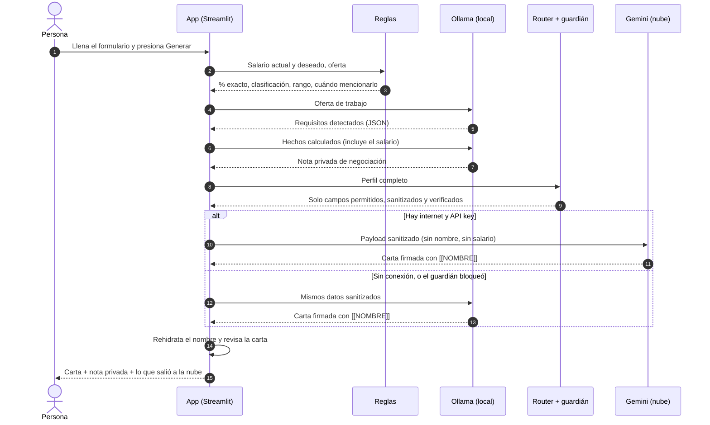

# ✉️ Carta Split Brain

App que genera una **carta de interés** para acompañar tu CV y una **nota privada de negociación salarial**, con una arquitectura *split brain*: una parte corre en la computadora empleando reglas y un modelo local con Ollama; y otra en la nube empleando Gemini.

> **Tu salario nunca sale de tu computadora.** Hay pruebas automatizadas que lo demuestran.

- 📝 **Artículo:** _[pegar aquí el link de Medium/Substack]_
- 🧭 **Todas las decisiones y su porqué:** [`docs/decisiones.md`](docs/decisiones.md)
- 🪜 **Guía para reproducir el proyecto desde cero:** [`docs/pasos.md`](docs/pasos.md)

**Contenido:** [Arquitectura](#1-arquitectura-qué-corre-dónde-y-por-qué) · [Paso a paso](#2-cómo-funciona-paso-a-paso) · [Instalación](#3-requisitos-e-instalación) · [Correr](#4-correr-la-app) · [Pruebas](#5-correr-las-pruebas) · [Ollama](#6-cómo-se-llama-al-componente-local-ollama) · [Gemini](#7-cómo-se-llama-a-la-api-en-la-nube-gemini) · [Evaluación de modelos](#8-evaluación-de-modelos-gemma-qwen-y-gemini) · [Conclusiones](#9-conclusiones) · [Limitaciones](#11-limitaciones-conocidas)

---

## 1. Arquitectura: qué corre dónde y por qué


*Fuente editable: [`docs/img/arquitectura.svg`](docs/img/arquitectura.svg).*

| Tarea | Dónde | Con qué | Razón |
|---|---|---|---|
| % de aumento, clasificación, rango de la oferta, cuándo mencionarlo | 🖥️ Local | Reglas | ⚡ latencia · 🎯 exactitud · 📴 sin conexión |
| Detectar datos sensibles y decidir qué sale | 🖥️ Local | Regex + allowlist | 🔒 privacidad (condición 3: explícito y probable) |
| Extraer requisitos de la oferta | 🖥️ Local | Ollama | ⚡ · 📴 · 💰 |
| Nota de negociación | 🖥️ Local | Ollama → reglas | 🔒 usa el salario · 📴 |
| Carta de interés | ☁️ Nube | Gemini | 🎯 calidad: el mejor calificado a ciegas y el que menos inventa, por margen estrecho ([sección 8](#8-evaluación-de-modelos-gemma-qwen-y-gemini)) · 💰 capa gratuita |
| Carta sin conexión | 🖥️ Local | Ollama → plantilla | 📴 |

**Qué nunca sale:** nombre, empleador actual, salario actual, salario deseado, moneda (`CAMPOS_SOLO_LOCAL` en `splitbrain/router.py`). Lo que sí sale pasa por el sanitizador y por un guardián que **falla cerrado**. En la app, el panel *"Exactamente lo que salió a la nube"* muestra el JSON enviado.

---

## 2. Cómo funciona, paso a paso

Esto es lo que pasa desde que presionas **Generar** hasta que ves la carta:



| # | Paso funcional | Dónde ocurre | Archivo | Si falla… |
|---|---|---|---|---|
| 1 | La persona llena el formulario: el salario va en campos numéricos propios | 🖥️ | `app.py` | — |
| 2 | Se calculan los **hechos**: % de aumento exacto, clasificación, rango de la oferta, cuándo mencionarlo | 🖥️ reglas | `splitbrain/reglas.py` | No falla: es aritmética |
| 3 | El modelo local extrae los **requisitos** de la oferta (JSON) | 🖥️ Ollama | `splitbrain/orquestador.py` | Se sigue sin requisitos, con un aviso |
| 4 | El modelo local redacta la **nota privada** a partir de los hechos | 🖥️ Ollama | `splitbrain/prompts.py` | Nota por reglas, sin modelo |
| 5 | El **sanitizador** reemplaza nombre, empleador, montos, correo y teléfono | 🖥️ regex | `splitbrain/sensibles.py` | — |
| 6 | El **router** arma el envío solo con campos permitidos y el **guardián** lo revisa | 🖥️ código | `splitbrain/router.py` | Si detecta una fuga, no se envía nada |
| 7 | **Gemini** redacta la carta con datos limpios y firma con `[[NOMBRE]]` | ☁️ | `splitbrain/nube.py` | Carta con el modelo local; si tampoco, plantilla |
| 8 | Se **rehidrata** el nombre y se revisa que la carta no mencione dinero ni marcadores | 🖥️ | `splitbrain/sensibles.py`, `reglas.py` | Aviso en pantalla |
| 9 | Se muestran la carta, la nota y **exactamente lo que salió a la nube** | 🖥️ | `app.py` | — |

**Los cuatro modos de funcionamiento**

| Situación | Carta | Nota privada |
|---|---|---|
| Internet ✅ + API key ✅ | ☁️ Gemini | 🖥️ Ollama |
| Internet ✅, sin API key | 🖥️ Ollama | 🖥️ Ollama |
| Sin internet | 🖥️ Ollama | 🖥️ Ollama |
| Sin internet y sin Ollama | 📄 Plantilla | 📐 Reglas |

---

## 3. Requisitos e instalación

- Python 3.11 o superior
- [Ollama](https://ollama.com/download) instalado y corriendo
- Unos 8 GB de RAM libres para un modelo de ~4B
- (Opcional) una API key de Gemini desde [Google AI Studio](https://aistudio.google.com/apikey). Sin ella la app funciona en modo local.

```bash
# 1. Clonar
git clone https://github.com/<tu-usuario>/carta-split-brain.git
cd carta-split-brain

# 2. Entorno virtual
python -m venv .venv
source .venv/bin/activate          # Windows: .venv\Scripts\activate

# 3. Dependencias
pip install -r requirements.txt

# 4. Modelos locales (verifica las etiquetas en https://ollama.com/library)
ollama pull gemma4:e4b
ollama pull qwen3.5:4b
ollama list                        # confirma que aparecen

# 5. Variables de entorno
cp .env.example .env               # Windows: copy .env.example .env
# abre .env y pega tu GEMINI_API_KEY (el .env nunca se sube: está en .gitignore)
```

## 4. Correr la app

```bash
streamlit run app.py
```

Se abre en `http://127.0.0.1:8501`. Para probar **sin conexión**, apaga el interruptor *"Usar la nube para la carta"*, desconecta el wifi, o arranca con:

```bash
FORZAR_SIN_CONEXION=1 streamlit run app.py      # Windows (PowerShell): $env:FORZAR_SIN_CONEXION=1
```

## 5. Correr las pruebas

```bash
pytest -v
```

No necesitan Ollama ni internet: usan clientes falsos que **registran todo lo que recibirían**. Las que demuestran las condiciones del reto:

| Condición | Prueba |
|---|---|
| El salario nunca sale | `tests/test_privacidad.py::test_lo_que_recibe_la_nube_no_tiene_salario` |
| El guardián atrapa el salario en 10 formatos (`12,500`, `12.5k`, `12.5 mil`, ×12, ×14…) | `test_guardian_atrapa_el_salario_en_cualquier_formato` |
| La decisión de qué sale es explícita | `tests/test_router.py::test_todo_campo_esta_clasificado_una_sola_vez` |
| Sin conexión sigue siendo útil | `tests/test_offline.py` |
| Ninguna clave real en los archivos que se suben | `tests/test_secretos.py` |

Corre `pytest` **antes de cada `git push`**: la última prueba existe porque una clave real quedó una vez en `.env.example` y GitHub bloqueó el push (D-30).

---

## 6. Cómo se llama al componente local (Ollama)

Ollama expone una API REST en `http://127.0.0.1:11434`. La app usa `/api/chat` con streaming:

```bash
curl http://127.0.0.1:11434/api/chat -d '{
  "model": "gemma4:e4b",
  "messages": [{"role": "user", "content": "Hola"}],
  "stream": false,
  "think": false,
  "options": {"temperature": 0.2, "seed": 42, "num_ctx": 4096}
}'
```

Desde Python (`splitbrain/local_llm.py`):

```python
from splitbrain.local_llm import ClienteOllama

cliente = ClienteOllama("gemma4:e4b")
g = cliente.generar("Escribe una frase de prueba", sistema="Responde en español")
print(g.texto)
print(g.metricas)   # latencia_total_s, ttft_s, tokens_por_s, carga_modelo_s, rss_pico_mb, ps_size_mb...
```

Otros endpoints usados: `/api/tags` (¿está el modelo?), `/api/ps` (memoria del modelo cargado) y `/api/generate` con `keep_alive: 0` (descargar el modelo entre corridas del benchmark).

## 7. Cómo se llama a la API en la nube (Gemini)

`splitbrain/nube.py` usa el SDK oficial `google-genai`. **Solo recibe un `PayloadNube` que ya pasó por `router.preparar_envio()`.**

```python
from google import genai
from google.genai import types

cliente = genai.Client(api_key=GEMINI_API_KEY,
                       http_options=types.HttpOptions(timeout=20000))
resp = cliente.models.generate_content(
    model="gemini-flash-latest",
    contents=prompt_carta(payload.campos),
    config=types.GenerateContentConfig(system_instruction=SISTEMA_CARTA, temperature=0.7),
)
```

- **Credencial:** `GEMINI_API_KEY` en `.env` (está en `.gitignore`; nunca se sube).
- **Si falla o tarda más de 20 s:** se lanza `NubeNoDisponible` y la carta se genera con el modelo local.
- **Qué se envía:** puesto actual, puesto y empresa objetivo, experiencia, logros, oferta y tono, todo sanitizado.

---

## 8. Evaluación de modelos: Gemma, Qwen y Gemini

Hay dos evaluaciones, y responden preguntas distintas:

| Evaluación | Pregunta | Script | Estado |
|---|---|---|---|
| **A. Carta en los tres modelos** | ¿Se justifica mandar la carta a la nube? | `bench/comparar_tres.py` | ✅ 3 corridas (90 cartas), lectura de 30 y evaluación ciega de 30 |
| **B. Gemma vs Qwen en las tareas solo locales** | ¿Cuál es el mejor modelo local para la nota y la extracción? | `bench/correr_bench.py` | ⏳ Pendiente |

### 8.1 Cómo se midió (igual para todos)

- **Mismas entradas:** 10 perfiles ficticios (`bench/casos.json`) con casos difíciles: datos sensibles escondidos en el texto, oferta en inglés, expectativa por encima y por debajo del rango.
- **Mismos prompts** (`splitbrain/prompts.py`) y **misma temperatura** (0.2). A Gemini se le envía el mismo payload sanitizado que usa la app.
- **Un modelo a la vez**, con una llamada de calentamiento que no se cuenta. El arranque se reporta aparte.
- **Razonamiento apagado** (`think: false`) en Gemma y Qwen.
- **Equipo:** laptop con AMD Ryzen 7 4800H, 16 GB de RAM, Ollama 0.35.1. Tarjeta gráfica: ⟦completar el modelo⟧; Ollama reporta ambos modelos cargados al 100 % en la GPU. Las latencias locales dependen de este equipo; las de Gemini, de la red.

**Qué se mide**

| Métrica | Cómo |
|---|---|
| Forma (automática) | Rúbrica de 6 criterios de sí/no: longitud, firma con marcador, sin dinero, menciona puesto y empresa, saludo y despedida, en español (`bench/rubrica.py`) |
| Fidelidad | Lectura de las 30 cartas contra el perfil: ¿afirma algo que la persona no dijo? La alerta `requisitos_sin_respaldo` solo indica qué frases revisar (D-24, D-28) |
| Calidad (humana) | Hoja ciega: naturalidad, persuasión, "lista para enviar", ¿inventa datos? |
| Latencia | Total por carta, mediana, mín–máx, desviación, tiempo al primer token, tokens/s, arranque |
| Memoria | Tamaño del modelo cargado y cuánto está en la GPU, según Ollama (`/api/ps`). La RAM del proceso se guarda, pero no sirve si el modelo corre en la GPU (D-27) |

### 8.2 Evaluación A · Resultados (3 corridas, 90 cartas)

| Corrida | Prompt | Qué la distingue | Se usa para concluir |
|---|---|---|---|
| 1 | Anterior a la regla 6 | Primera corrida completa | Latencia y rúbrica (las cartas ya no existen: ver nota) |
| 1b | Con regla 6 | El equipo cayó a un tercio de su velocidad a mitad de la corrida | Solo como evidencia de variabilidad |
| **2** | Con regla 6 | Gemini también se calienta; más métricas | ✅ **Corrida de referencia** |


**Corrida 2 (referencia): 30 cartas**

| Modelo | Dónde | Lista para enviar (1–5, ciega) | Cartas que inventan (ciega) | Forma (rúbrica) | Latencia mediana | Mín–máx | Primer token | Tokens/s | Memoria del modelo | Arranque |
|---|---|---|---|---|---|---|---|---|---|---|
| gemma4:e4b | 🖥️ local | 4.20 | 5 de 10 | 1.00 | 9.5 s | 8.9–10.8 s | 1.4 s | 41.9 | 3,096 MB (100 % GPU) | 20.9 s |
| qwen3.5:4b | 🖥️ local | 3.40 | 8 de 10 | 1.00 | 22.8 s | 19.3–24.2 s | 3.8 s | 20.1 | 2,988 MB (100 % GPU) | 13.1 s |
| gemini | ☁️ nube | 4.40 | 3 de 9 | 1.00 | 8.0 s | 7.2–18.2 s | — | — | No usa tu equipo | 9.4 s |

- *Forma*: después de corregir un criterio demasiado estricto (D-28), las 30 cartas cumplen los 6 criterios. La rúbrica ya no distingue entre modelos.
- *Lista para enviar* y *Cartas que inventan*: evaluación humana a ciegas de las 30 cartas (sección 8.4). Una carta de Gemini quedó sin marcar en "inventa".
- *Tamaños comparables*: los dos modelos locales ocupan casi lo mismo en memoria (diferencia de 108 MB, un 3.5 %).
- *Tokens de Gemini por carta*: unos 366 de entrada y 304 de salida visibles.

**Las tres corridas, lado a lado (latencia mediana)**

| Modelo | Corrida 1 | Corrida 1b | Corrida 2 |
|---|---|---|---|
| gemma4:e4b | 10.3 s | 10.5 s | 9.5 s |
| qwen3.5:4b | 22.1 s | **58.4 s** | 22.8 s |
| gemini | 9.3 s | 11.8 s | 8.0 s |

**Tres notas de honestidad sobre estos datos**

1. **Las cartas de la corrida 1 se perdieron.** La corrida 1b se guardó en la misma carpeta y las reemplazó. Por eso no hay un "antes y después" de la regla 6 con las mismas cartas. Quedan sus latencias y su rúbrica ([captura](docs/img/corrida_10_perfiles.png)). El script ahora se niega a escribir sobre una corrida existente (D-27).
2. **En la corrida 1b Qwen tardó 58 s por carta, 2.6 veces más que en las otras dos**, con el mismo prompt y el mismo equipo. Una corrida posterior mostró la causa más probable: bajo carga sostenida, el equipo baja a un tercio de su velocidad durante unos 10 minutos (sección 8.6). En la 1b esa caída empezó en la última carta de Gemma (30 s en vez de 10) y abarcó las diez de Qwen. No dice nada sobre Qwen: le tocó correr en el peor momento.
3. **La mediana de la corrida 1** se imprimió mal en la terminal (10.37, 22.28 y 10.74 s). La tabla usa la mediana correcta (D-25).

### 8.3 ¿Cuál es mejor en cada apartado? (corrida 2)

| Apartado | Gemma 4 E4B | Qwen 3.5 4B | Gemini | Mejor | Evidencia |
|---|---|---|---|---|---|
| **Fidelidad** (no inventa) | 5 de 10 cartas inventan | 8 de 10 | 3 de 9 | **Gemini**; entre locales, **Gemma** | Evaluación ciega. Con un criterio más estricto de qué cuenta como inventar: 2, 5 y 0 (8.4) |
| Forma (rúbrica) | 1.00 | 1.00 | 1.00 | Empate | 30 de 30 cartas con 6/6 |
| Concordancia de género | 1 error en 5 | 3 errores en 5 | 0 en 5 | **Gemini** | Perfiles de mujeres con adjetivos en masculino (8.5) |
| Latencia mediana | 9.5 s | 22.8 s | 8.0 s | Gemini, por 1.6 s | Gemini ganó en 2 de 3 corridas; en la 1b ganó Gemma por 1.3 s |
| Estabilidad | ±0.58 s | ±1.44 s | ±3.48 s | **Gemma** | Gemma varía 1.9 s entre cartas; Gemini, 11 s |
| Peor caso | 10.8 s | 24.2 s | 18.2 s | **Gemma** | La carta más lenta de Gemini tardó un 70 % más que la más lenta de Gemma |
| Velocidad de generación | 41.9 tokens/s | 20.1 tokens/s | — | **Gemma** | El doble, con el mismo equipo y la misma memoria |
| Tiempo al primer token | 1.4 s | 3.8 s | — | **Gemma** | Lo que tarda en aparecer la primera palabra |
| Memoria del modelo | 3,096 MB | 2,988 MB | No usa tu equipo | Qwen, por 108 MB | Diferencia del 3.5 %: en la práctica, empate |
| Arranque | 20.9 s | 13.1 s | 9.4 s | No concluyente | Qwen arrancó antes en 2 de 3 corridas. ⏳ Medición controlada en la evaluación B |
| Bajo carga sostenida | Baja a un tercio | Baja a un tercio | Depende de la red | Ninguno | Cuando el equipo se satura, los dos locales se frenan igual: Gemma pasó de 10 a 30 s y Qwen de 20 a 59 s (8.6) |
| Privacidad | Nada sale | Nada sale | Salen datos sanitizados | **Locales** | Por diseño |
| Sin conexión | Funciona | Funciona | No funciona | **Locales** | `tests/test_offline.py` |
| Costo por carta | Solo tu equipo | Solo tu equipo | Gratis en la capa gratuita; de pago, una fracción de centavo de dólar | **Locales** | Unos 670 tokens por carta. Estimación: verificar el precio vigente |
| **Lista para enviar** (1–5) | 4.20 | 3.40 | 4.40 | Gemini, por 0.2; entre locales, **Gemma** por 0.8 | Evaluación ciega de 30 cartas |

**Lectura:**
- **Entre los modelos locales, Gemma gana en casi todo:** genera el doble de rápido, empieza a escribir antes, inventa menos y sus cartas se calificaron 0.8 puntos mejor. Qwen solo gana en memoria, por un margen del 3.5 %.
- **Por qué Qwen es más lento:** no es por escribir más (sus cartas son un 12 % más largas) ni por quedarse sin memoria de GPU (está cargado al 100 %). Genera 20 tokens por segundo contra 42 de Gemma en el mismo equipo. Tampoco "piensa" a escondidas: la relación entre tokens y palabras es la misma en ambos (1.3).
- **Gemini gana donde más importa para esta app, pero por poco:** es el que menos inventa (3 de 9 cartas contra 5 de 10 de Gemma) y el mejor calificado (4.40 contra 4.20). También suele ser algo más rápido, pero impredecible: entre 7 y 18 s por la misma tarea.
- **El modelo local quedó a 0.2 puntos del de la nube.** Con 10 cartas por modelo, esa diferencia no es concluyente.

### 8.4 Hallazgo: una carta que inventó habilidades

Al leer la carta de Gemini para el perfil c08 (corrida de 2 perfiles) apareció un problema que ninguna métrica había detectado:

**Lo que la persona dijo de sí misma:** ejecutivo de ventas, 5 años en su empresa, cerró contratos en 2024. Nada más.

| Requisito de la oferta | ¿Estaba en el perfil? | Lo que la carta afirmó | Gravedad |
|---|---|---|---|
| CRM (Salesforce) | ❌ No | *"Cuento con experiencia en el uso de Salesforce para el seguimiento de oportunidades y la gestión del ciclo comercial"* | 🔴 Inventado: una herramienta concreta |
| Inglés | ❌ No | *"Me comunico con fluidez en inglés"* | 🔴 Inventado: se comprueba en la primera entrevista |
| Negociación, B2B | ❌ No, aunque es razonable en ventas | *"…perfeccionar mis habilidades de negociación con interlocutores clave en el entorno B2B"* | 🟡 Supuesto plausible |
| Remoto | ❌ No | *"Poseo la autogestión y disciplina necesarias para… esquemas a distancia"* | 🟡 Supuesto plausible |

El modelo tomó los **requisitos de la oferta** y los presentó como **experiencia de la persona**. Esa carta obtuvo 1.00 en la rúbrica.


En esa misma prueba, la rúbrica original le había quitado un punto a esa carta por "saludo y despedida", cuando cerraba correctamente con *"Un cordial saludo,"*. Es decir: la rúbrica castigó lo que estaba bien y no vio lo que estaba mal.

| Problema | Corrección | Decisión |
|---|---|---|
| Criterio de despedida demasiado estrecho | Lista ampliada + 5 pruebas | D-23 |
| Nadie medía si la carta dice la verdad | Regla 6 en el prompt · alerta `requisitos_sin_respaldo` · columna humana `inventa_datos_si_no` | D-24 |

**¿Funcionó la regla 6? Antes y después, mismo modelo y mismo perfil (Gemini, c08)**

| | Lo que escribió |
|---|---|
| Antes (sin la regla 6) | *"Cuento con experiencia en el uso de Salesforce… Me comunico con fluidez en inglés."* |
| Después (con la regla 6) | *"…con plena disposición y entusiasmo para… familiarizarme con el uso de Salesforce y alinearme con los estándares de negociación y comunicación en inglés…"* |

Es un solo caso, pero es directo: la misma información, y el modelo pasó de afirmar a ofrecer disposición. Para Gemma y Qwen no existe el "antes": sus cartas de la corrida 1 se perdieron.

**Evaluación humana a ciegas de las 30 cartas de la corrida 2**

Cada carta se calificó sin saber qué modelo la escribió (códigos `C000`–`C029`, orden revuelto).

| Modelo | Lista para enviar (1–5) | Cartas marcadas "inventa datos" |
|---|---|---|
| Gemini | **4.40** | 3 de 9 |
| Gemma 4 E4B | 4.20 | 5 de 10 |
| Qwen 3.5 4B | 3.40 | 8 de 10 |

- El orden es el mismo en las dos medidas: Gemini, Gemma, Qwen.
- **Gemma queda muy cerca de Gemini** (0.2 puntos y 2 cartas). **Qwen queda lejos de los dos** (1 punto, y 8 de cada 10 cartas con algo inventado).
- Ningún modelo quedó libre: incluso el de la nube tuvo cartas marcadas.
- Límites: una sola persona calificó; naturalidad y persuasión no se calificaron; una carta de Gemini quedó sin respuesta en "inventa".
- **Las dos columnas no son independientes.** Las notas fueron solo 3 o 5, y casi siempre 3 cuando la carta se marcó como "inventa" y 5 cuando no (una excepción en 29). En la práctica, la evaluación ciega midió una sola cosa: si la carta inventa.

**Segunda lectura, con un criterio más estricto (no ciega)**

Aquí cuenta como "inventa" solo cuando la carta **afirma tener** una herramienta, título, idioma o requisito concreto que no está en el perfil. No cuentan el interés por aprender, los supuestos razonables ni los adornos. Por eso los números son más bajos que en la evaluación ciega; el orden es el mismo.

| Modelo | Cartas que inventan | Perfil | Lo que afirmó | Lo que la persona dijo |
|---|---|---|---|---|
| **Gemini** | **0 de 10** | — | En las 10 cartas presenta los requisitos como algo por aprender | — |
| **Gemma** | **2 de 10** | c03 | *"mi nivel de inglés B2 me permite comunicarme eficazmente"* | 3 años de QA manual en apps móviles |
| | | c04 | *"cuento con licencia de conducir"* | Mapeo catastral con QGIS y ArcGIS |
| **Qwen** | **5 de 10** | c01 | *"poseo mi título de Contador(a) Colegiado, tengo dominio avanzado de Excel… y conozco el funcionamiento del SAT"* | 4 años llevando contabilidad de pymes |
| | | c02 | *"he desarrollado una sólida base en la gestión de bases de datos relacionales y el control de versiones mediante Git"* | Soporte a usuarios y scripts en Python |
| | | c04 | *"La licencia de conducir me permite cubrir desplazamientos rápidos"* | Mapeo catastral con QGIS y ArcGIS |
| | | c06 | *"reportes alineados a los criterios GRI, áreas donde mi historial demuestra capacidad"* | 12 años en manufactura |
| | | c09 | *"una comprensión profunda de las necesidades del mercado SaaS"* | 4 años atendiendo clientes en inglés |

Qwen además adornó logros con detalles que nadie le dio: *"cientos de predios"* (c04), *"una plataforma financiera"* (c07), *"más de ochenta colaboradores"* cuando el perfil dice 80 (c06).

**Cómo leer esta tabla**
- Es una lectura **no ciega**, hecha con ayuda de un asistente de IA. La evaluación ciega confirma el orden, pero no el "0 de 10" de Gemini: con un criterio más amplio, 3 de sus cartas también se marcaron.
- **Comparación carta por carta (29 cartas con respuesta):** las 7 cartas de esta tabla también se marcaron a ciegas; ninguna quedó fuera. La evaluación ciega marcó 9 más (3 por modelo), todas con afirmaciones más suaves: supuestos razonables o adornos. En 13 cartas las dos lecturas coinciden en que no hay nada inventado.
- Los tres modelos recibieron la misma regla. La diferencia está en **cuánto la obedecen**: el modelo de la nube más que los pequeños, y Gemma más que Qwen.
- La alerta automática marcó 8, 9 y 9 cartas de cada 10, casi igual en los tres modelos. No sirve para contar: se dispara igual con *"domino Git"* que con *"quiero aprender Git"*. Sirve para saber qué frases leer.

### 8.5 Lo que la privacidad le costó a la calidad

Dos efectos que solo aparecieron al leer las cartas. En ambos la protección funcionó; lo que se perdió fue información útil.

**1. Al ocultar el nombre, también se ocultó el género.**
La carta se redacta sin saber cómo se llama la persona. Cuando el puesto tampoco da pistas ("QA manual", "Agente bilingüe"), el modelo no puede saber si escribir "motivada" o "motivado".

| Modelo | Errores de género en los 5 perfiles de mujeres | Detalle |
|---|---|---|
| Gemini | 0 | Donde no había pista, escribió sin adjetivos de género |
| Gemma | 1 | c03: "motivado", "convencido" (sin pista en los datos) |
| Qwen | 3 | c03 y c09 (sin pista), y c01, donde el puesto decía "Contadora" |

**2. El sanitizador borró números que no eran dinero.**
Trata como monto cualquier número de 1,000 o más sin unidad. Así:

| Perfil | Texto original | Lo que recibió el modelo | Consecuencia |
|---|---|---|---|
| c04 | "Digitalicé 5,000 predios en un año" | "Digitalicé[MONTO] predios en un año" | Gemini omitió el logro; Gemma lo dejó sin cifra; Qwen inventó "cientos de predios" |
| c06 | "ISO 14001" | "ISO[MONTO]" | Ninguna carta pudo nombrar la norma |

Ambos son errores **del lado seguro** (se protege de más, no de menos), y por eso no los atrapó ninguna prueba de privacidad. Propuestas para corregirlos, aún sin aplicar para no cambiar las condiciones a mitad de la evaluación (D-28):
- Pedir en el prompt redacción neutra cuando no se conoce el género.
- Sanitizar un número sin moneda solo si cerca hay una palabra de dinero ("gano", "salario", "al mes"). El guardián seguiría bloqueando el salario en cualquier formato.

### 8.6 Evaluación B · Gemma vs Qwen en las tareas que solo hace el modelo local ⏳

Compara los dos modelos locales en la **nota de negociación** y la **extracción de requisitos**, con 2 repeticiones y arranque en frío. La carta no se repite aquí: ya se midió en tres corridas de la evaluación A.

```bash
python -m bench.correr_bench --simulado              # verifica el script sin Ollama
python -m bench.correr_bench --modelos gemma4:e4b    # un modelo (unos 7 min)
python -m bench.correr_bench --modelos qwen3.5:4b    # el otro (unos 10 min)
python -m bench.correr_bench --estado                # cuánto falta
python -m bench.analizar                             # tablas y gráficas
```

**Por qué es ligera y se puede retomar (D-29).** La primera versión hacía 174 generaciones seguidas (3 tareas × 3 repeticiones) y la laptop de pruebas **se apagó sola** durante la corrida, probablemente por temperatura. Ahora:
- cada respuesta se guarda en disco al instante; si el equipo se apaga, el mismo comando continúa donde se quedó;
- hace una pausa de 3 s entre respuestas y un descanso de 60 s cada 15;
- se corre un modelo por vez.

Resultados: [`resultados/resumen.md`](resultados/resumen.md).

**Lo que ya mostró una corrida larga (Qwen, 87 respuestas seguidas sin pausas)**


| Tramo | Respuestas | Duración | Tokens/s | Una carta tarda |
|---|---|---|---|---|
| Normal | 1–55 | 10.7 min | 20.0 | 20 s |
| Lento | 56–75 | 10.6 min | **6.9** | **59 s** |
| Recuperado | 76–87 | 1.6 min | 20.5 | 20 s |

- El modelo, el prompt y la memoria no cambiaron: lo que cambió fue el equipo. El patrón (carga sostenida, caída brusca, recuperación sola) es el de una laptop que se protege del calor, aunque no se midió la temperatura.
- Explica la corrida 1b: los 58 s por carta de Qwen son el mismo "modo lento".
- Dos lecciones de medición que salieron de esta corrida (D-30): las tres repeticiones de cada texto eran **idénticas** porque compartían semilla, así que no aportaban nada a la calidad; y el tiempo al primer token de las repeticiones 2 y 3 salía en 0.3 s porque el prompt ya estaba en caché (en la primera, 1.3 a 3.7 s).

Datos: [`resultados/corrida_larga_qwen/`](resultados/corrida_larga_qwen/).

### 8.7 Cómo reproducir la evaluación A

```bash
python -m bench.comparar_tres --casos c01 c08               # prueba rápida con 2 perfiles
python -m bench.comparar_tres --carpeta tres_modelos_v3     # los 10 perfiles, en carpeta propia
python -m bench.comparar_tres --reevaluar --carpeta tres_modelos_v2   # recalifica sin regenerar
python -m bench.comparar_tres --ciega --carpeta tres_modelos_v2       # resume tu evaluación a ciegas
```

Cada corrida deja en `resultados/<carpeta>/`: `resumen.md` (tabla + gráfica), `metricas.csv`, `cartas_lado_a_lado.md`, `cartas_crudas.jsonl`, `arranque.json` y la hoja ciega. La nota privada nunca entra en esta comparación: lleva el salario (D-22).

### 8.8 Por qué algunas partes NO usan modelo

| Parte | Regla | Por qué no un modelo |
|---|---|---|
| % de aumento | `(deseado − actual) / actual` | Un modelo puede equivocarse en aritmética; la división no |
| Clasificación de la expectativa | Umbrales 10 / 25 / 40 % | Predecible, discutible y probable |
| Rango salarial de la oferta | Regex de montos con moneda | Los montos tienen formato; no hace falta interpretar |
| Cuándo mencionarla | Árbol de 5 reglas | El consejo debe ser consistente para la misma situación |
| Detectar sensibles | Regex + búsqueda exacta | La condición 3 exige una decisión probable |

Lo vimos en la práctica: todo lo inventado en el proyecto salió de un modelo (8.4). Las reglas nunca inventan.

---

## 9. Conclusiones

Cada conclusión indica en qué se apoya y qué falta para cerrarla.

**1. Mejor modelo local para este reto: Gemma 4 E4B.**
- *Velocidad:* con el mismo equipo y casi la misma memoria, genera el doble de rápido que Qwen (41.9 contra 20.1 tokens/s), empieza a escribir antes (1.4 s contra 3.8 s) y termina la carta en menos de la mitad del tiempo (9.5 s contra 22.8 s). Fue más rápido en las 30 comparaciones perfil a perfil de las tres corridas.
- *Calidad:* en la evaluación ciega sus cartas sacaron 4.20 de 5 contra 3.40 de Qwen, y se marcaron como "inventa" 5 de 10 contra 8 de 10.
- *En qué pierde:* usa 108 MB más de memoria (un 3.5 %) y arrancó más lento en 2 de 3 corridas (unos 7 s). Y aun ganando, la mitad de sus cartas tuvo algo que revisar.
- *Qué falta:* la nota y la extracción, en la evaluación B.

**2. La nube escribe la carta algo mejor que el mejor modelo local; la ventaja es pequeña.**
- *Evaluación ciega:* Gemini 4.40 contra Gemma 4.20 en "lista para enviar", y 3 de 9 cartas marcadas como "inventa" contra 5 de 10.
- *Forma:* empate (30 de 30 cartas con 6/6).
- *Qué dicen las reglas fijadas de antemano:* la diferencia de 0.2 no alcanza el umbral de 0.5 de D-26, lo que apuntaría a generar la carta en local. La enmienda de D-28 dice que, si esa nota y la fidelidad apuntan en direcciones distintas, pesa más la fidelidad, y en fidelidad Gemini va adelante en las dos lecturas.
- *Decisión:* **la carta se queda en la nube cuando hay conexión**, con Gemma como respaldo. Es una decisión por margen estrecho: con 10 cartas por modelo, ninguna de las dos diferencias es concluyente.
- *Lo que esto significa para lo local:* un modelo de 3 GB en una laptop quedó a 0.2 puntos del modelo de la nube. Quien valore más la privacidad, el costo o trabajar sin conexión puede poner la carta en local (un interruptor en la app) perdiendo poco.
- *El precio de la nube:* los datos sanitizados salen del equipo, hace falta internet, y la latencia varía entre 7 y 18 s.

**3. Una rúbrica automática mide la forma, no la verdad.**
- *Evidencia:* una carta con habilidades inventadas obtuvo 1.00, y dos cartas correctas perdieron puntos por criterios demasiado estrictos (D-23, D-28). Corregidos esos criterios, las 30 cartas sacan 1.00 y la rúbrica deja de distinguir modelos, mientras que una persona las separó por un punto entero (3.40 a 4.40). La alerta de fidelidad se dispara en 26 de 30 cartas y tampoco decide sola.
- *Consecuencia:* lo que separó a los modelos fue **leer las cartas**. Las métricas automáticas sirvieron para descartar errores de forma y para saber dónde mirar.

**4. Decir "no inventes" no basta: ningún modelo lo cumplió siempre.**
- *Evidencia:* la regla 6 cambió a Gemini de afirmar Salesforce e inglés a ofrecer disposición para aprenderlos, con los mismos datos. Aun así, en la evaluación ciega se marcaron como "inventa" 3 de 9 cartas de Gemini, 5 de 10 de Gemma y 8 de 10 de Qwen.
- *Consecuencia:* una instrucción reduce el problema, no lo elimina, y cuanto más pequeño el modelo, menos la obedece. Toda carta, local o de la nube, debería mostrarse con el aviso de qué frases revisar.

**5. La privacidad tiene un costo en calidad, y hay que medirlo.**
- *Evidencia:* ocultar el nombre dejó a los modelos sin saber el género (4 cartas con el género equivocado, 3 de ellas sin ninguna pista en los datos), y el sanitizador borró "5,000 predios" e "ISO 14001" por parecer montos (8.5).
- *Consecuencia:* las pruebas de privacidad no ven estos errores, porque son del lado seguro. Solo aparecen al leer el resultado.

**6. Lo local depende de tu equipo, no solo del modelo.**
- *Arranque:* cargar el modelo (12–21 s) cuesta más que escribir una carta con Gemma (10 s).
- *Entorno:* el mismo modelo, con el mismo prompt y en la misma máquina, tardó 22 s en dos corridas y 58 s en otra. Un número de latencia sin sus condiciones no significa nada.
- *Carga sostenida:* tras 10.7 minutos generando sin pausa, la velocidad cayó de 20 a 7 tokens por segundo y tardó otros 10.6 minutos en recuperarse; una carta pasó de 20 s a 59 s (8.6). Otra corrida larga llegó a apagar la laptop. Lo que en la nube es "mandar más peticiones", en local es calor, y hubo que rediseñar la evaluación con pausas y guardado continuo (D-29, D-30).

**7. Lo que debe ser exacto o privado no se le encarga a un modelo.**
- *Evidencia:* el % de aumento, el rango y la decisión de qué sale a la nube están en código con pruebas (67 pasan). Todo lo inventado en el proyecto salió de un modelo.

**8. El split brain no es "local contra nube": es poner cada tarea donde corresponde.**
- La nota va en local por **privacidad**, sin importar quién escriba mejor. La carta va a la nube por **calidad**, por un margen que ahora está medido, y a local cuando no hay conexión.

---

## 10. Estructura

```
carta-split-brain/
├── app.py                  # interfaz Streamlit (local)
├── splitbrain/
│   ├── perfil.py           # datos de la persona
│   ├── reglas.py           # heurísticas deterministas
│   ├── sensibles.py        # sanitizador regex + rehidratación
│   ├── router.py           # allowlist + guardián (qué sale a la nube)
│   ├── prompts.py          # prompts compartidos por todos los modelos
│   ├── local_llm.py        # cliente Ollama + métricas
│   ├── nube.py             # cliente Gemini + chequeo de conexión
│   └── orquestador.py      # une todo y degrada con elegancia
├── bench/
│   ├── casos.json          # 10 perfiles ficticios
│   ├── rubrica.py          # criterios de calidad y alerta de fidelidad
│   ├── comparar_tres.py    # evaluación A: carta en Gemma, Qwen y Gemini
│   ├── hoja.py             # lectura de las hojas de evaluación ciega
│   ├── correr_bench.py     # evaluación B: Gemma vs Qwen en nota y extracción (se puede retomar)
│   └── analizar.py         # tablas y gráficas de la evaluación B
├── tests/                  # pytest (67 pruebas, incluida una que busca claves filtradas)
├── docs/
│   ├── decisiones.md       # registro de decisiones (D-01 a D-30)
│   ├── articulo.md         # borrador del artículo
│   ├── pasos.md            # guía para reproducir el proyecto
│   └── img/                # diagramas, capturas y gráficas
└── resultados/             # salidas de las evaluaciones
```

## 11. Limitaciones conocidas

- **Tamaño de la muestra:** 10 perfiles ficticios. Las diferencias pequeñas (Gemma contra Gemini en latencia o en una carta de la rúbrica) no son concluyentes.
- **Entorno no controlado:** las corridas se hicieron en una computadora de uso diario. La corrida 1b muestra cuánto puede cambiar la latencia local si la máquina está ocupada.
- **Una sola persona calificó a ciegas**, y solo dos de las cuatro columnas, que además resultaron medir lo mismo. La segunda lectura de fidelidad no es ciega y se hizo con ayuda de un asistente de IA. Las dos coinciden en el orden, no en las cantidades.
- **El sanitizador protege de más:** borra números de 1,000 o más aunque no sean dinero (8.5).
- **Sin el nombre, el modelo no conoce el género** de la persona (8.5).
- **Latencia de Gemini no del todo comparable:** incluye la red y puede incluir razonamiento interno, que en los modelos locales está apagado (D-12).
- **La rúbrica automática mide la forma de la carta**, no si lo que afirma es cierto. La alerta `requisitos_sin_respaldo` y la evaluación humana cubren esa parte de forma parcial.
- **El sanitizador no detecta cifras escritas en letras** ("doce mil"). Por eso el salario tiene su propio campo numérico, que nunca se envía.
- **Los umbrales de "expectativa razonable"** son una convención explícita, no un estudio de mercado.
- **La oferta de trabajo se envía a la nube** (sanitizada). Si pegas notas personales dentro de la oferta, revisa el panel de lo enviado.

## Licencia

MIT
