# ✉️ Carta Split Brain

App que genera una **carta de interés** para acompañar tu CV y una **nota privada de negociación salarial**, con una arquitectura *split brain*: una parte corre en la computadora empleando reglas y un modelo local con Ollama; y otra en la nube empleando Gemini.

> **Tu salario nunca sale de tu computadora.** Hay pruebas automatizadas que lo demuestran.

- ▶️ **Abrir la app:** `streamlit run app.py` y luego [http://127.0.0.1:8501](http://127.0.0.1:8501) en el navegador ([paso a paso](#4-correr-la-app))
- 📝 **Artículo:** [borrador en Google Docs](https://docs.google.com/document/d/1XtgVbPtav0GUsPADeTeq1btN52LrwP3H2yMmbkSToLM/edit) · fuente en [`docs/articulo.md`](docs/articulo.md)
- 🧭 **Todas las decisiones y su porqué:** [`docs/decisiones.md`](docs/decisiones.md)
- 🪜 **Guía para reproducir el proyecto desde cero:** [`docs/pasos.md`](docs/pasos.md)
- 🎬 **Guion y formularios de ejemplo para demostraciones:** [`docs/demo.md`](docs/demo.md)

**Contenido:** [Arquitectura](#1-arquitectura-qué-corre-dónde-y-por-qué) · [Paso a paso](#2-cómo-funciona-paso-a-paso) · [Instalación](#3-requisitos-e-instalación) · [Correr](#4-correr-la-app) · [Pruebas](#5-correr-las-pruebas) · [Ollama](#6-cómo-se-llama-al-componente-local-ollama) · [Gemini](#7-cómo-se-llama-a-la-api-en-la-nube-gemini) · [Evaluación de modelos](#8-evaluación-de-modelos-gemma-qwen-y-gemini) · [Conclusiones](#9-conclusiones) · [Limitaciones](#11-limitaciones-conocidas)

---

## 1. Arquitectura: qué corre dónde y por qué

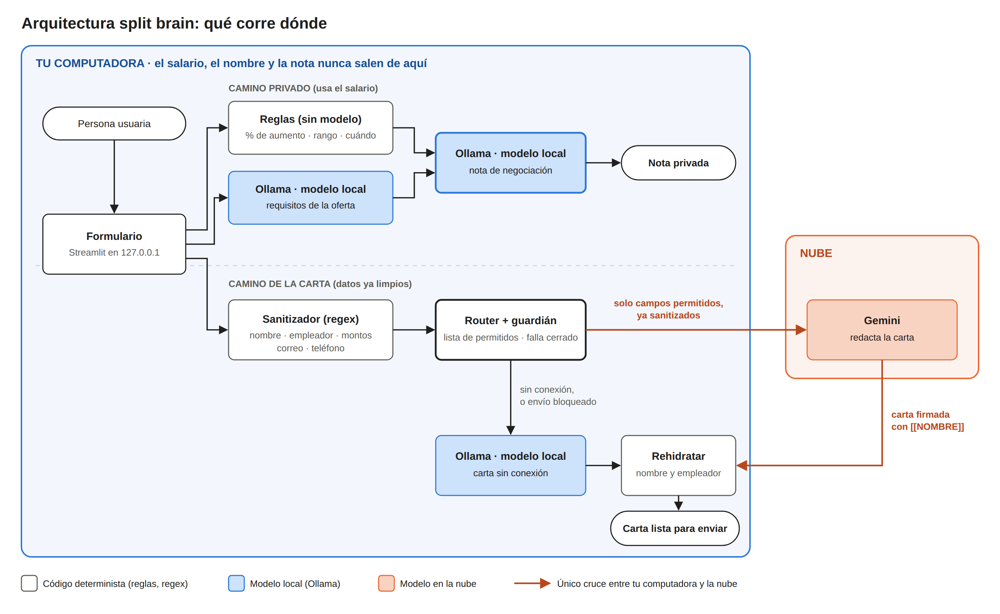

*Fuente editable: [`docs/img/arquitectura.svg`](docs/img/arquitectura.svg).*

| Tarea | Dónde | Con qué | Razón |
|---|---|---|---|
| % de aumento, clasificación, rango de la oferta, cuándo mencionarlo | 🖥️ Local | Reglas | ⚡ latencia · 🎯 exactitud · 📴 sin conexión |
| Detectar datos sensibles y decidir qué sale | 🖥️ Local | Regex + allowlist | 🔒 privacidad (condición 3: explícito y probable) |
| Extraer requisitos de la oferta | 🖥️ Local | Ollama | ⚡ · 📴 · 💰 |
| Nota de negociación | 🖥️ Local | Ollama redacta el consejo; las reglas ponen las cifras y revisan lo escrito | 🔒 usa el salario · 📴 · 🎯 las cifras no dependen del modelo ([8.6](#86-evaluación-b--gemma-vs-qwen-en-las-tareas-que-solo-hace-el-modelo-local)) |
| Carta de interés | ☁️ Nube | Gemini | 🎯 calidad: el mejor calificado a ciegas y el que menos inventa, por margen estrecho ([sección 8](#8-evaluación-de-modelos-gemma-qwen-y-gemini)) · 💰 capa gratuita |
| Carta sin conexión | 🖥️ Local | Ollama → plantilla | 📴 |

**Qué nunca sale:** nombre, empleador actual, salario actual, salario deseado, moneda (`CAMPOS_SOLO_LOCAL` en `splitbrain/router.py`). Lo que sí sale pasa por el sanitizador y por un guardián que **falla cerrado**. En la app, el panel *"Exactamente lo que salió a la nube"* muestra el JSON enviado.

---

## 2. Cómo funciona, paso a paso

Esto es lo que pasa desde que presionas **Generar** hasta que ves la carta:

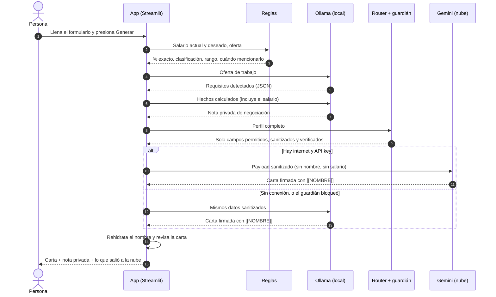

| # | Paso funcional | Dónde ocurre | Archivo | Si falla… |
|---|---|---|---|---|
| 1 | La persona llena el formulario: el salario va en campos numéricos propios | 🖥️ | `app.py` | — |
| 2 | Se calculan los **hechos**: % de aumento exacto, clasificación, rango de la oferta, cuándo mencionarlo | 🖥️ reglas | `splitbrain/reglas.py` | No falla: es aritmética |
| 3 | El modelo local extrae los **requisitos** de la oferta (JSON) | 🖥️ Ollama | `splitbrain/orquestador.py` | Se sigue sin requisitos, con un aviso |
| 4 | El modelo local redacta la **nota privada** a partir de los hechos. Las reglas revisan lo que escribió: avisan si trae una cifra que no venía en los datos o si parece un mensaje para la empresa | 🖥️ Ollama + reglas | `splitbrain/prompts.py`, `reglas.py` | Nota por reglas, sin modelo |
| 5 | El **sanitizador** reemplaza nombre, empleador, montos, correo y teléfono | 🖥️ regex | `splitbrain/sensibles.py` | — |
| 6 | El **router** arma el envío solo con campos permitidos y el **guardián** lo revisa | 🖥️ código | `splitbrain/router.py` | Si detecta una fuga, no se envía nada |
| 7 | **Gemini** redacta la carta con datos limpios y firma con `[[NOMBRE]]` | ☁️ | `splitbrain/nube.py` | Carta con el modelo local; si tampoco, plantilla |
| 8 | Se **rehidrata** el nombre y se revisa que la carta no mencione dinero ni marcadores | 🖥️ | `splitbrain/sensibles.py`, `reglas.py` | Aviso en pantalla |
| 9 | Se muestran la carta, la nota con sus **datos exactos calculados por reglas**, y **exactamente lo que salió a la nube** | 🖥️ | `app.py` | — |

**Los modos de funcionamiento**

| Situación | Carta | Nota privada |
|---|---|---|
| Internet ✅ + API key ✅ | ☁️ Gemini | 🖥️ Ollama |
| Internet ✅ + API key ✅, pero la nube no responde | 🖥️ Ollama, con un aviso | 🖥️ Ollama |
| Internet ✅, sin API key | 🖥️ Ollama | 🖥️ Ollama |
| Sin internet | 🖥️ Ollama | 🖥️ Ollama |
| Sin internet y sin Ollama | 📄 Plantilla | 📐 Reglas |

### Un caso real: la nube no respondió

Ocurrió en una prueba normal de la app, con internet y con la clave configurada. Nadie lo provocó.

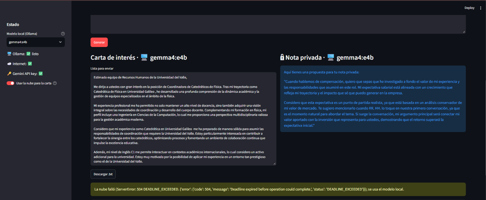

| Paso | Qué pasó | Tiempo |
|---|---|---|
| 1 | El modelo local escribió la nota privada. Era la primera petición, así que Ollama tuvo que cargar el modelo | 16.3 s (11.2 s de carga + 5.1 s de escritura) |
| 2 | La app envió los datos sanitizados a Gemini. Gemini no terminó dentro del límite de 20 s y respondió `504 DEADLINE_EXCEEDED` | 20 s |
| 3 | La app pasó sola al modelo local, que escribió la carta | 9.9 s, a 41.2 tokens/s |
| 4 | Se mostró la carta con el aviso: *"La nube falló (…); se usa el modelo local"* | — |

- **La persona recibió su carta y su nota.** Es la condición 4 del reto (seguir siendo útil sin la nube), vista en uso real y no solo en `tests/test_offline.py`.
- **Los tiempos coinciden con la evaluación:** 5.1 s de escritura para la nota (mediana medida: 5.0 s) y 9.9 s para la carta (9.5 s), a 41 tokens por segundo (41.9).
- **La nota repitió, en vivo, los dos defectos de la sección 8.6:** empieza con *"Aquí tienes una propuesta para tu nota privada"*, está escrita como un mensaje para la empresa (*"quiero que sepas que he investigado a fondo…"*) y no cita ninguna cifra. Con la versión actual, la app muestra al lado los datos exactos y avisa (D-31).

**Esta prueba descubrió un error en el panel de transparencia.**

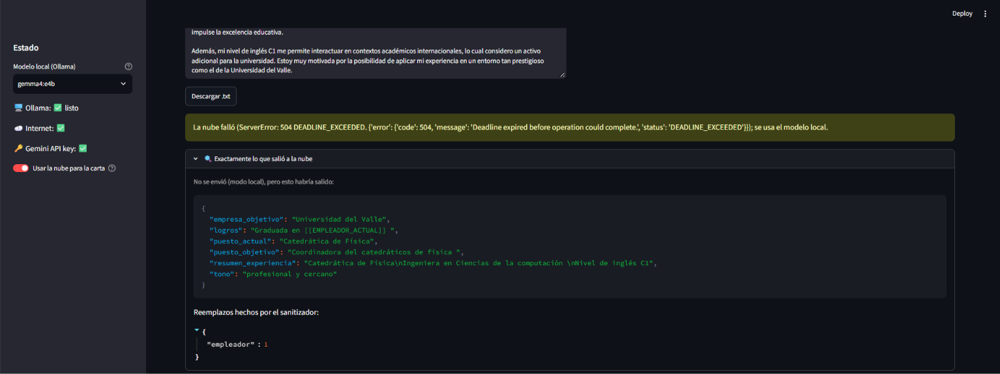

El panel decía *"No se envió (modo local)"*. No era cierto: un error 504 lo devuelve el servidor, así que la petición sí había llegado a Gemini. Lo que salió eran datos sanitizados (el empleador viaja como `[[EMPLEADOR_ACTUAL]]`, y el nombre y los salarios no viajan), pero la app prometía más de lo que cumplía. Ahora distingue los casos (D-33):

| Situación | Lo que dice el panel |
|---|---|
| La nube devolvió la carta | "Enviado ✅" |
| Se envió, pero la nube falló | "Se envió ⚠️, pero la nube no devolvió la carta (la escribió el modelo local). Esto es lo que salió:" |
| Nunca se intentó (sin conexión, sin clave o interruptor apagado) | "No se envió (modo local), pero esto habría salido:" |
| El guardián detectó una fuga | "Nada: el guardián bloqueó el envío." |

Prueba: `tests/test_offline.py::test_si_la_nube_falla_se_dice_que_los_datos_si_salieron`.

**La misma prueba, con la nube apagada**

Minutos después se repitió el mismo formulario con el interruptor *"Usar la nube para la carta"* apagado.

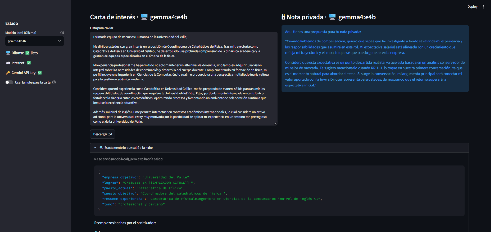

| | Nube encendida (falló) | Nube apagada |
|---|---|---|
| Nota privada | 16.3 s (incluye 11.2 s de carga del modelo) | 4.6 s |
| Espera a la nube | Unos 20 s | — |
| Carta | 9.9 s · 41.2 tokens/s | 8.2 s · 42.9 tokens/s |
| Primer token de la carta | 1.5 s | 0.3 s |
| **Total aproximado** | **46 s** | **13 s** |
| Tokens generados (nota / carta) | 161 / 318 | 161 / 318 |
| Texto de la carta y de la nota | — | El mismo, palabra por palabra |
| Lo que dice el panel | "No se envió" (incorrecto: ver arriba) | "No se envió" (correcto) |

- **El texto es idéntico en las dos pruebas.** Confirma que la carta de la primera la escribió Gemma y no la nube. Y muestra una propiedad del modelo local tal como está configurado (temperatura 0.2 y semilla fija): con los mismos datos, devuelve lo mismo.
- **La diferencia de 33 s no es "nube contra local".** Son 11 s de cargar el modelo la primera vez y unos 20 s esperando a una nube que no respondió. Con el modelo ya cargado, todo en local tarda 13 s.
- **El primer token bajó de 1.5 s a 0.3 s** porque el prompt era idéntico y Ollama lo tenía en caché: el mismo efecto que se detectó en la evaluación (D-30).
- **Falta la tercera columna:** la misma prueba con Gemini respondiendo. Para compararlos con rigor está la evaluación A (sección 8).

**La misma prueba con Qwen**

El mismo formulario, en local, cambiando el modelo en la barra lateral.

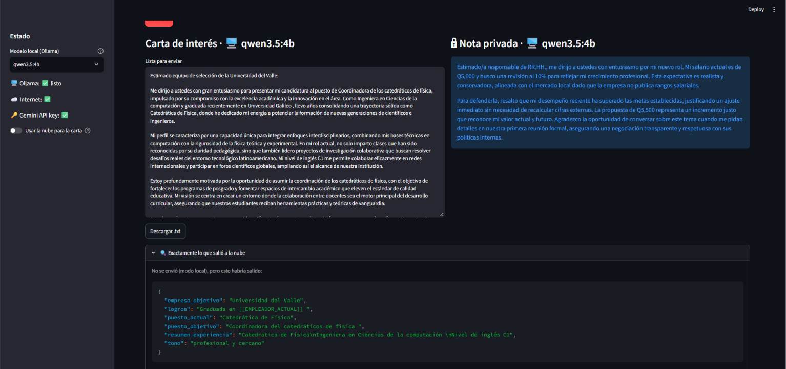

| | Gemma 4 E4B | Qwen 3.5 4B |
|---|---|---|
| Nota, sin contar la carga | 4.6 s y 5.1 s | 10.5 s |
| Carta | 8.2 s y 9.9 s | 22.4 s |
| Velocidad | 41 a 45 tokens/s | 20 tokens/s |
| Primer token de la carta (sin caché) | 1.5 s | 3.8 s |
| Largo de la carta | 318 tokens | 366 tokens |
| Memoria del modelo | 3,096 MB | 2,988 MB |
| Carga del modelo | 11.2 s | 24.2 s (había que sacar antes a Gemma de la memoria) |
| **La nota: a quién le habla** | A la empresa: *"quiero que sepas que he investigado a fondo…"* | A la empresa: *"Estimado/a responsable de RR.HH., me dirijo a ustedes…"* |
| **La nota: cifras** | Ninguna | *"Mi salario actual es de Q5,000"*, 10 % y Q5,500 (las tres correctas) |
| **La carta: lo que afirma sin que la persona lo dijera** | *"mi formación en física"*, *"gestión de equipos especializados"* | *"graduada recientemente"*, *"clases que han sido reconocidas por su claridad pedagógica"*, *"lidero proyectos de investigación colaborativa"*, *"foros científicos globales"* |

Lo que la persona escribió de sí misma: catedrática de Física, ingeniera en Ciencias de la Computación, inglés C1, graduada de la universidad donde trabaja.

- **Es un solo ejemplo, y repite lo que midió la evaluación (sección 8):** Qwen tarda algo más del doble, usa las cifras en la nota y la redacta como un mensaje a la empresa con el salario actual, y adorna más la carta. Gemma no pone cifras en la nota.
- **Esta vez Gemma también le habló a la empresa en la nota.** En la evaluación lo hizo en 5 de 20.
- **Con la versión actual de la app**, las dos notas habrían mostrado el aviso *"La nota parece escrita como un mensaje para la empresa"*, y debajo los datos exactos: de Q5,000 a Q5,500, **+10.0 %, expectativa conservadora** (D-31). Estas capturas se tomaron con la versión anterior.
- **La carga del modelo no favorece a ninguno de forma estable:** aquí Qwen tardó 24 s y Gemma 11 s; en la evaluación B fue al revés (9.0 s y 11.6 s). Depende de qué había antes en la memoria.

<details>
<summary>Métricas de las tres pruebas</summary>

Nube encendida (falló):

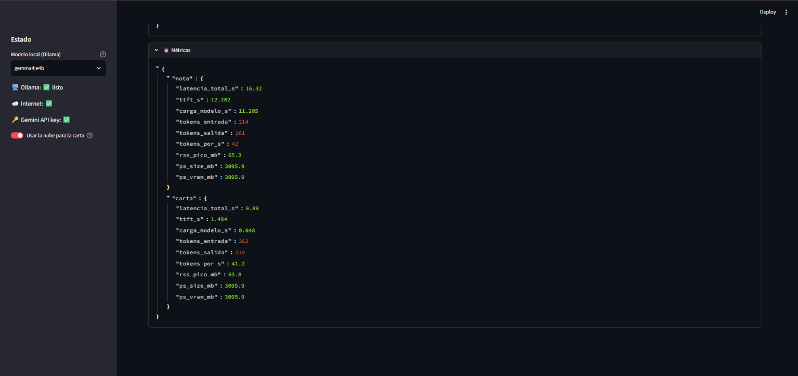

Nube apagada:

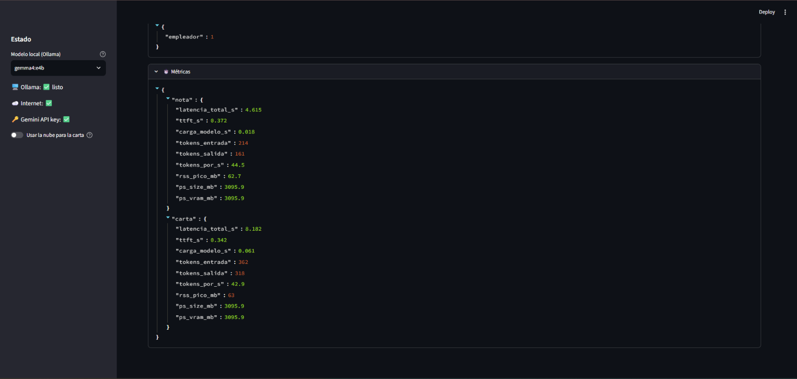

Qwen, nube apagada:

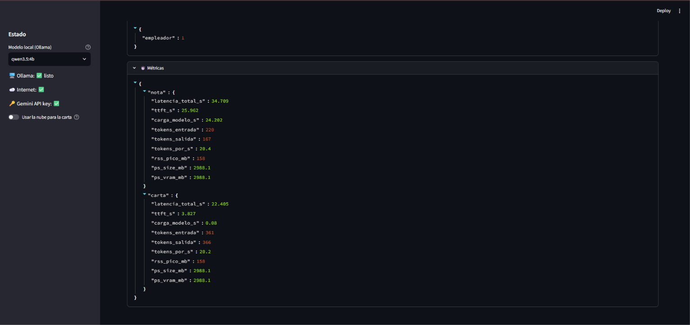

</details>

---

## 3. Requisitos e instalación

- Python 3.11 o superior
- [Ollama](https://ollama.com/download) instalado y corriendo
- Unos 8 GB de RAM libres para un modelo de ~4B
- (Opcional) una API key de Gemini desde [Google AI Studio](https://aistudio.google.com/apikey). Sin ella la app funciona en modo local.

```bash
# 1. Clonar
git clone https://github.com/CatherineBatres/carta-split-brain.git
cd carta-split-brain

# 2. Entorno virtual
python -m venv .venv
source .venv/bin/activate          # Windows: .venv\Scripts\activate

# 3. Dependencias
pip install -r requirements.txt

# 4. Modelos locales (verifica las etiquetas en https://ollama.com/library)
ollama pull gemma4:e4b
ollama pull qwen3.5:4b
ollama list                        # confirma que aparecen

# 5. Variables de entorno
cp .env.example .env               # Windows: copy .env.example .env
# abre .env y pega tu GEMINI_API_KEY (el .env nunca se sube: está en .gitignore)
```

## 4. Correr la app

La app se usa desde el navegador, pero corre en tu computadora. Son tres pasos:

**1. Abre una terminal en la carpeta del proyecto** (donde está `app.py`) y activa el entorno:

```bash
.venv\Scripts\activate            # Windows
source .venv/bin/activate         # Mac o Linux
```

**2. Arranca la app:**

```bash
streamlit run app.py
```

**3. Abre este enlace en el navegador:**

> **http://127.0.0.1:8501**

La terminal muestra ese mismo enlace cuando la app está lista. No se abre solo: cópialo y pégalo en la barra de direcciones. Para apagar la app, vuelve a la terminal y presiona `Ctrl + C`.

| Antes de arrancar | Cómo comprobarlo |
|---|---|
| Ollama está abierto | `ollama list` muestra `gemma4:e4b` y `qwen3.5:4b` |
| El entorno está activo | La línea de la terminal empieza con `(.venv)` |
| (Opcional) La clave de Gemini está en `.env` | En la app, la barra lateral dice "🔑 Gemini API key: ✅" |

**Ese enlace solo funciona en la computadora donde corre la app.** `127.0.0.1` significa "esta misma máquina": si se lo envías a otra persona, no verá nada. Es a propósito. La app escucha solo en esa dirección (`.streamlit/config.toml`) para que nadie más en la red pueda entrar a una pantalla donde se escribe un salario. Por la misma razón no hay una versión publicada en internet: el "dispositivo" pasaría a ser un servidor ajeno (D-03). Para mostrarla a otras personas sin que la instalen hace falta un video o capturas.

**Formularios de ejemplo.** En la barra lateral, la sección **🎬 Demostración** llena el formulario de un clic con una de cinco personas ficticias (`demo/formularios.json`). Sirve para probar la app sin escribir y para demostraciones en vivo; el guion está en [`docs/demo.md`](docs/demo.md).

**Probar sin conexión.** Apaga el interruptor *"Usar la nube para la carta"*, desconecta el wifi, o arranca con:

```bash
set "FORZAR_SIN_CONEXION=1" && streamlit run app.py      # Windows (Símbolo del sistema)
$env:FORZAR_SIN_CONEXION=1; streamlit run app.py         # Windows (PowerShell)
FORZAR_SIN_CONEXION=1 streamlit run app.py               # Mac o Linux
```

## 5. Correr las pruebas

```bash
pytest -v
```

No necesitan Ollama ni internet: usan clientes falsos que **registran todo lo que recibirían**. Las que demuestran las condiciones del reto:

| Condición | Prueba |
|---|---|
| El salario nunca sale | `tests/test_privacidad.py::test_lo_que_recibe_la_nube_no_tiene_salario` |
| El guardián atrapa el salario en 10 formatos (`12,500`, `12.5k`, `12.5 mil`, ×12, ×14…) | `test_guardian_atrapa_el_salario_en_cualquier_formato` |
| La decisión de qué sale es explícita | `tests/test_router.py::test_todo_campo_esta_clasificado_una_sola_vez` |
| Sin conexión sigue siendo útil | `tests/test_offline.py` |
| Ninguna clave real en los archivos que se suben | `tests/test_secretos.py` |
| Las cifras de la nota no dependen del modelo, y se avisa si el modelo cambia una | `tests/test_nota.py` |

Corre `pytest` **antes de cada `git push`**: la prueba de claves existe porque una clave real quedó una vez en `.env.example` y GitHub bloqueó el push (D-30).

---

## 6. Cómo se llama al componente local (Ollama)

Ollama expone una API REST en `http://127.0.0.1:11434`. La app usa `/api/chat` con streaming:

```bash
curl http://127.0.0.1:11434/api/chat -d '{
  "model": "gemma4:e4b",
  "messages": [{"role": "user", "content": "Hola"}],
  "stream": false,
  "think": false,
  "options": {"temperature": 0.2, "seed": 42, "num_ctx": 4096}
}'
```

Desde Python (`splitbrain/local_llm.py`):

```python
from splitbrain.local_llm import ClienteOllama

cliente = ClienteOllama("gemma4:e4b")
g = cliente.generar("Escribe una frase de prueba", sistema="Responde en español")
print(g.texto)
print(g.metricas)   # latencia_total_s, ttft_s, tokens_por_s, carga_modelo_s, rss_pico_mb, ps_size_mb...
```

Otros endpoints usados: `/api/tags` (¿está el modelo?), `/api/ps` (memoria del modelo cargado) y `/api/generate` con `keep_alive: 0` (descargar el modelo entre corridas del benchmark).

## 7. Cómo se llama a la API en la nube (Gemini)

`splitbrain/nube.py` usa el SDK oficial `google-genai`. **Solo recibe un `PayloadNube` que ya pasó por `router.preparar_envio()`.**

```python
from google import genai
from google.genai import types

cliente = genai.Client(api_key=GEMINI_API_KEY,
                       http_options=types.HttpOptions(timeout=20000))
resp = cliente.models.generate_content(
    model="gemini-flash-latest",
    contents=prompt_carta(payload.campos),
    config=types.GenerateContentConfig(system_instruction=SISTEMA_CARTA, temperature=0.7),
)
```

- **Credencial:** `GEMINI_API_KEY` en `.env` (está en `.gitignore`; nunca se sube).
- **Si falla o tarda más de 20 s:** se lanza `NubeNoDisponible` y la carta se genera con el modelo local.
- **Qué se envía:** puesto actual, puesto y empresa objetivo, experiencia, logros, oferta y tono, todo sanitizado.

---

## 8. Evaluación de modelos: Gemma, Qwen y Gemini

Hay dos evaluaciones, y responden preguntas distintas:

| Evaluación | Pregunta | Script | Estado |
|---|---|---|---|
| **A. Carta en los tres modelos** | ¿Se justifica mandar la carta a la nube? | `bench/comparar_tres.py` | ✅ 3 corridas (90 cartas), lectura de 30 y evaluación ciega de 30 |
| **B. Gemma vs Qwen en las tareas solo locales** | ¿Cuál es el mejor modelo local para la nota y la extracción? | `bench/correr_bench.py` | ✅ 76 respuestas, lectura de las 40 notas y evaluación ciega de 20 |

### 8.1 Cómo se midió (igual para todos)

- **Mismas entradas:** 10 perfiles ficticios (`bench/casos.json`) con casos difíciles: datos sensibles escondidos en el texto, oferta en inglés, expectativa por encima y por debajo del rango.
- **Mismos prompts** (`splitbrain/prompts.py`) y **misma temperatura** (0.2). A Gemini se le envía el mismo payload sanitizado que usa la app.
- **Un modelo a la vez**, con una llamada de calentamiento que no se cuenta. El arranque se reporta aparte.
- **Razonamiento apagado** (`think: false`) en Gemma y Qwen.
- **Equipo:** laptop con AMD Ryzen 7 4800H, 16 GB de RAM, Ollama 0.35.1. Tarjeta gráfica: ⟦completar el modelo⟧; Ollama reporta ambos modelos cargados al 100 % en la GPU. Las latencias locales dependen de este equipo; las de Gemini, de la red.

**Qué se mide**

| Métrica | Cómo |
|---|---|
| Forma (automática) | Rúbrica de 6 criterios de sí/no: longitud, firma con marcador, sin dinero, menciona puesto y empresa, saludo y despedida, en español (`bench/rubrica.py`) |
| Fidelidad | Lectura de las 30 cartas contra el perfil: ¿afirma algo que la persona no dijo? La alerta `requisitos_sin_respaldo` solo indica qué frases revisar (D-24, D-28) |
| Calidad (humana) | Hoja ciega: naturalidad, persuasión, "lista para enviar", ¿inventa datos? |
| Latencia | Total por carta, mediana, mín–máx, desviación, tiempo al primer token, tokens/s, arranque |
| Memoria | Tamaño del modelo cargado y cuánto está en la GPU, según Ollama (`/api/ps`). La RAM del proceso se guarda, pero no sirve si el modelo corre en la GPU (D-27) |

### 8.2 Evaluación A · Resultados (3 corridas, 90 cartas)

| Corrida | Prompt | Qué la distingue | Se usa para concluir |
|---|---|---|---|
| 1 | Anterior a la regla 6 | Primera corrida completa | Latencia y rúbrica (las cartas ya no existen: ver nota) |
| 1b | Con regla 6 | El equipo cayó a un tercio de su velocidad a mitad de la corrida | Solo como evidencia de variabilidad |
| **2** | Con regla 6 | Gemini también se calienta; más métricas | ✅ **Corrida de referencia** |

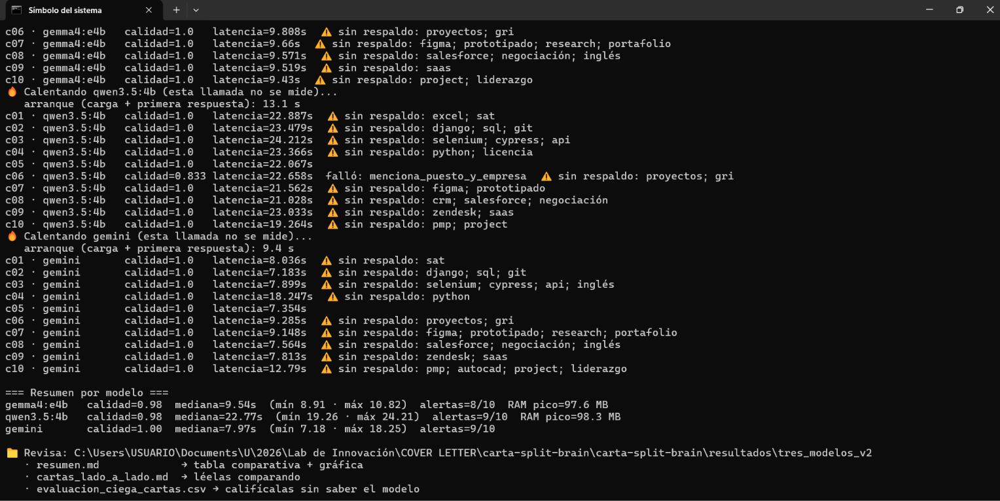

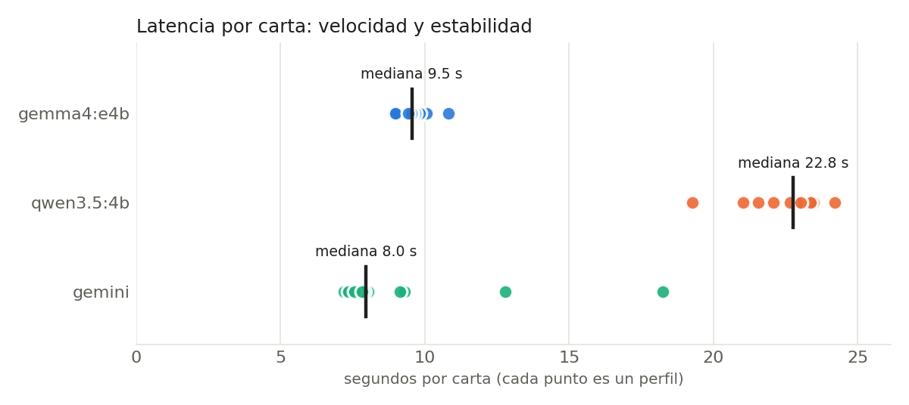

**Corrida 2 (referencia): 30 cartas**

| Modelo | Dónde | Lista para enviar (1–5, ciega) | Cartas que inventan (ciega) | Forma (rúbrica) | Latencia mediana | Mín–máx | Primer token | Tokens/s | Memoria del modelo | Arranque |
|---|---|---|---|---|---|---|---|---|---|---|
| gemma4:e4b | 🖥️ local | 4.20 | 5 de 10 | 1.00 | 9.5 s | 8.9–10.8 s | 1.4 s | 41.9 | 3,096 MB (100 % GPU) | 20.9 s |
| qwen3.5:4b | 🖥️ local | 3.40 | 8 de 10 | 1.00 | 22.8 s | 19.3–24.2 s | 3.8 s | 20.1 | 2,988 MB (100 % GPU) | 13.1 s |
| gemini | ☁️ nube | 4.40 | 3 de 9 | 1.00 | 8.0 s | 7.2–18.2 s | — | — | No usa tu equipo | 9.4 s |

- *Forma*: después de corregir un criterio demasiado estricto (D-28), las 30 cartas cumplen los 6 criterios. La rúbrica ya no distingue entre modelos.
- *Lista para enviar* y *Cartas que inventan*: evaluación humana a ciegas de las 30 cartas (sección 8.4). Una carta de Gemini quedó sin marcar en "inventa".
- *Tamaños comparables*: los dos modelos locales ocupan casi lo mismo en memoria (diferencia de 108 MB, un 3.5 %).
- *Tokens de Gemini por carta*: unos 366 de entrada y 304 de salida visibles.

**Las tres corridas, lado a lado (latencia mediana)**

| Modelo | Corrida 1 | Corrida 1b | Corrida 2 |
|---|---|---|---|
| gemma4:e4b | 10.3 s | 10.5 s | 9.5 s |
| qwen3.5:4b | 22.1 s | **58.4 s** | 22.8 s |
| gemini | 9.3 s | 11.8 s | 8.0 s |

**Tres notas de honestidad sobre estos datos**

1. **Las cartas de la corrida 1 se perdieron.** La corrida 1b se guardó en la misma carpeta y las reemplazó. Por eso no hay un "antes y después" de la regla 6 con las mismas cartas. Quedan sus latencias y su rúbrica ([captura](docs/img/corrida_10_perfiles.png)). El script ahora se niega a escribir sobre una corrida existente (D-27).
2. **En la corrida 1b Qwen tardó 58 s por carta, 2.6 veces más que en las otras dos**, con el mismo prompt y el mismo equipo. Una corrida posterior mostró la causa más probable: bajo carga sostenida, el equipo baja a un tercio de su velocidad durante unos 10 minutos (sección 8.6). En la 1b esa caída empezó en la última carta de Gemma (30 s en vez de 10) y abarcó las diez de Qwen. No dice nada sobre Qwen: le tocó correr en el peor momento.
3. **La mediana de la corrida 1** se imprimió mal en la terminal (10.37, 22.28 y 10.74 s). La tabla usa la mediana correcta (D-25).

### 8.3 ¿Cuál es mejor en cada apartado? (corrida 2)

| Apartado | Gemma 4 E4B | Qwen 3.5 4B | Gemini | Mejor | Evidencia |
|---|---|---|---|---|---|
| **Fidelidad** (no inventa) | 5 de 10 cartas inventan | 8 de 10 | 3 de 9 | **Gemini**; entre locales, **Gemma** | Evaluación ciega. Con un criterio más estricto de qué cuenta como inventar: 2, 5 y 0 (8.4) |
| Forma (rúbrica) | 1.00 | 1.00 | 1.00 | Empate | 30 de 30 cartas con 6/6 |
| Concordancia de género | 1 error en 5 | 3 errores en 5 | 0 en 5 | **Gemini** | Perfiles de mujeres con adjetivos en masculino (8.5) |
| Latencia mediana | 9.5 s | 22.8 s | 8.0 s | Gemini, por 1.6 s | Gemini ganó en 2 de 3 corridas; en la 1b ganó Gemma por 1.3 s |
| Estabilidad | ±0.58 s | ±1.44 s | ±3.48 s | **Gemma** | Gemma varía 1.9 s entre cartas; Gemini, 11 s |
| Peor caso | 10.8 s | 24.2 s | 18.2 s | **Gemma** | La carta más lenta de Gemini tardó un 70 % más que la más lenta de Gemma |
| Velocidad de generación | 41.9 tokens/s | 20.1 tokens/s | — | **Gemma** | El doble, con el mismo equipo y la misma memoria |
| Tiempo al primer token | 1.4 s | 3.8 s | — | **Gemma** | Lo que tarda en aparecer la primera palabra |
| Memoria del modelo | 3,096 MB | 2,988 MB | No usa tu equipo | Qwen, por 108 MB | Diferencia del 3.5 %: en la práctica, empate |
| Arranque | 20.9 s | 13.1 s | 9.4 s | Sin ventaja clara entre locales | Qwen cargó antes en 3 de 5 mediciones, por pocos segundos; en una prueba en la app tardó 24 s contra 11 s de Gemma. Entre 9 y 24 s según qué había en memoria |
| Bajo carga sostenida | Baja a un tercio | Baja a un tercio | Depende de la red | Ninguno | Cuando el equipo se satura, los dos locales se frenan igual: Gemma pasó de 10 a 30 s y Qwen de 20 a 58 s (8.6) |
| Privacidad | Nada sale | Nada sale | Salen datos sanitizados | **Locales** | Por diseño |
| Sin conexión | Funciona | Funciona | No funciona | **Locales** | `tests/test_offline.py` |
| Costo por carta | Solo tu equipo | Solo tu equipo | Gratis en la capa gratuita; de pago, una fracción de centavo de dólar | **Locales** | Unos 670 tokens por carta. Estimación: verificar el precio vigente |
| **Lista para enviar** (1–5) | 4.20 | 3.40 | 4.40 | Gemini, por 0.2; entre locales, **Gemma** por 0.8 | Evaluación ciega de 30 cartas |

**Lectura:**
- **Entre los modelos locales, Gemma gana la carta en casi todo:** genera el doble de rápido, empieza a escribir antes, inventa menos y sus cartas se calificaron 0.8 puntos mejor. Qwen gana en memoria (un 3.5 %); en arranque ninguno tiene una ventaja estable. La nota y la extracción están en la sección 8.6.
- **Por qué Qwen es más lento:** no es por escribir más (sus cartas son un 12 % más largas) ni por quedarse sin memoria de GPU (está cargado al 100 %). Genera 20 tokens por segundo contra 42 de Gemma en el mismo equipo. Tampoco "piensa" a escondidas: la relación entre tokens y palabras es la misma en ambos (1.3).
- **Gemini gana donde más importa para esta app, pero por poco:** es el que menos inventa (3 de 9 cartas contra 5 de 10 de Gemma) y el mejor calificado (4.40 contra 4.20). También suele ser algo más rápido, pero impredecible: entre 7 y 18 s por la misma tarea.
- **El modelo local quedó a 0.2 puntos del de la nube.** Con 10 cartas por modelo, esa diferencia no es concluyente.

### 8.4 Hallazgo: una carta que inventó habilidades

Al leer la carta de Gemini para el perfil c08 (corrida de 2 perfiles) apareció un problema que ninguna métrica había detectado:

**Lo que la persona dijo de sí misma:** ejecutivo de ventas, 5 años en su empresa, cerró contratos en 2024. Nada más.

| Requisito de la oferta | ¿Estaba en el perfil? | Lo que la carta afirmó | Gravedad |
|---|---|---|---|
| CRM (Salesforce) | ❌ No | *"Cuento con experiencia en el uso de Salesforce para el seguimiento de oportunidades y la gestión del ciclo comercial"* | 🔴 Inventado: una herramienta concreta |
| Inglés | ❌ No | *"Me comunico con fluidez en inglés"* | 🔴 Inventado: se comprueba en la primera entrevista |
| Negociación, B2B | ❌ No, aunque es razonable en ventas | *"…perfeccionar mis habilidades de negociación con interlocutores clave en el entorno B2B"* | 🟡 Supuesto plausible |
| Remoto | ❌ No | *"Poseo la autogestión y disciplina necesarias para… esquemas a distancia"* | 🟡 Supuesto plausible |

El modelo tomó los **requisitos de la oferta** y los presentó como **experiencia de la persona**. Esa carta obtuvo 1.00 en la rúbrica.

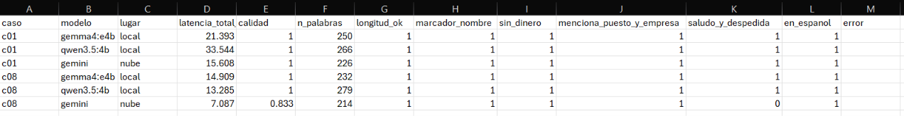

En esa misma prueba, la rúbrica original le había quitado un punto a esa carta por "saludo y despedida", cuando cerraba correctamente con *"Un cordial saludo,"*. Es decir: la rúbrica castigó lo que estaba bien y no vio lo que estaba mal.

| Problema | Corrección | Decisión |
|---|---|---|
| Criterio de despedida demasiado estrecho | Lista ampliada + 5 pruebas | D-23 |
| Nadie medía si la carta dice la verdad | Regla 6 en el prompt · alerta `requisitos_sin_respaldo` · columna humana `inventa_datos_si_no` | D-24 |

**¿Funcionó la regla 6? Antes y después, mismo modelo y mismo perfil (Gemini, c08)**

| | Lo que escribió |
|---|---|
| Antes (sin la regla 6) | *"Cuento con experiencia en el uso de Salesforce… Me comunico con fluidez en inglés."* |
| Después (con la regla 6) | *"…con plena disposición y entusiasmo para… familiarizarme con el uso de Salesforce y alinearme con los estándares de negociación y comunicación en inglés…"* |

Es un solo caso, pero es directo: la misma información, y el modelo pasó de afirmar a ofrecer disposición. Para Gemma y Qwen no existe el "antes": sus cartas de la corrida 1 se perdieron.

**Evaluación humana a ciegas de las 30 cartas de la corrida 2**

Cada carta se calificó sin saber qué modelo la escribió (códigos `C000`–`C029`, orden revuelto).

| Modelo | Lista para enviar (1–5) | Cartas marcadas "inventa datos" |
|---|---|---|
| Gemini | **4.40** | 3 de 9 |
| Gemma 4 E4B | 4.20 | 5 de 10 |
| Qwen 3.5 4B | 3.40 | 8 de 10 |

- El orden es el mismo en las dos medidas: Gemini, Gemma, Qwen.
- **Gemma queda muy cerca de Gemini** (0.2 puntos y 2 cartas). **Qwen queda lejos de los dos** (1 punto, y 8 de cada 10 cartas con algo inventado).
- Ningún modelo quedó libre: incluso el de la nube tuvo cartas marcadas.
- Límites: una sola persona calificó; naturalidad y persuasión no se calificaron; una carta de Gemini quedó sin respuesta en "inventa".
- **Las dos columnas no son independientes.** Las notas fueron solo 3 o 5, y casi siempre 3 cuando la carta se marcó como "inventa" y 5 cuando no (una excepción en 29). En la práctica, la evaluación ciega midió una sola cosa: si la carta inventa.

**Segunda lectura, con un criterio más estricto (no ciega)**

Aquí cuenta como "inventa" solo cuando la carta **afirma tener** una herramienta, título, idioma o requisito concreto que no está en el perfil. No cuentan el interés por aprender, los supuestos razonables ni los adornos. Por eso los números son más bajos que en la evaluación ciega; el orden es el mismo.

| Modelo | Cartas que inventan | Perfil | Lo que afirmó | Lo que la persona dijo |
|---|---|---|---|---|
| **Gemini** | **0 de 10** | — | En las 10 cartas presenta los requisitos como algo por aprender | — |
| **Gemma** | **2 de 10** | c03 | *"mi nivel de inglés B2 me permite comunicarme eficazmente"* | 3 años de QA manual en apps móviles |
| | | c04 | *"cuento con licencia de conducir"* | Mapeo catastral con QGIS y ArcGIS |
| **Qwen** | **5 de 10** | c01 | *"poseo mi título de Contador(a) Colegiado, tengo dominio avanzado de Excel… y conozco el funcionamiento del SAT"* | 4 años llevando contabilidad de pymes |
| | | c02 | *"he desarrollado una sólida base en la gestión de bases de datos relacionales y el control de versiones mediante Git"* | Soporte a usuarios y scripts en Python |
| | | c04 | *"La licencia de conducir me permite cubrir desplazamientos rápidos"* | Mapeo catastral con QGIS y ArcGIS |
| | | c06 | *"reportes alineados a los criterios GRI, áreas donde mi historial demuestra capacidad"* | 12 años en manufactura |
| | | c09 | *"una comprensión profunda de las necesidades del mercado SaaS"* | 4 años atendiendo clientes en inglés |

Qwen además adornó logros con detalles que nadie le dio: *"cientos de predios"* (c04), *"una plataforma financiera"* (c07), *"más de ochenta colaboradores"* cuando el perfil dice 80 (c06).

**Cómo leer esta tabla**
- Es una lectura **no ciega**, hecha con ayuda de un asistente de IA. La evaluación ciega confirma el orden, pero no el "0 de 10" de Gemini: con un criterio más amplio, 3 de sus cartas también se marcaron.
- **Comparación carta por carta (29 cartas con respuesta):** las 7 cartas de esta tabla también se marcaron a ciegas; ninguna quedó fuera. La evaluación ciega marcó 9 más (3 por modelo), todas con afirmaciones más suaves: supuestos razonables o adornos. En 13 cartas las dos lecturas coinciden en que no hay nada inventado.
- Los tres modelos recibieron la misma regla. La diferencia está en **cuánto la obedecen**: el modelo de la nube más que los pequeños, y Gemma más que Qwen.
- La alerta automática marcó 8, 9 y 9 cartas de cada 10, casi igual en los tres modelos. No sirve para contar: se dispara igual con *"domino Git"* que con *"quiero aprender Git"*. Sirve para saber qué frases leer.

### 8.5 Lo que la privacidad le costó a la calidad

Dos efectos que solo aparecieron al leer las cartas. En ambos la protección funcionó; lo que se perdió fue información útil.

**1. Al ocultar el nombre, también se ocultó el género.**
La carta se redacta sin saber cómo se llama la persona. Cuando el puesto tampoco da pistas ("QA manual", "Agente bilingüe"), el modelo no puede saber si escribir "motivada" o "motivado".

| Modelo | Errores de género en los 5 perfiles de mujeres | Detalle |
|---|---|---|
| Gemini | 0 | Donde no había pista, escribió sin adjetivos de género |
| Gemma | 1 | c03: "motivado", "convencido" (sin pista en los datos) |
| Qwen | 3 | c03 y c09 (sin pista), y c01, donde el puesto decía "Contadora" |

**2. El sanitizador borró números que no eran dinero.**
Trata como monto cualquier número de 1,000 o más sin unidad. Así:

| Perfil | Texto original | Lo que recibió el modelo | Consecuencia |
|---|---|---|---|
| c04 | "Digitalicé 5,000 predios en un año" | "Digitalicé[MONTO] predios en un año" | Gemini omitió el logro; Gemma lo dejó sin cifra; Qwen inventó "cientos de predios" |
| c06 | "ISO 14001" | "ISO[MONTO]" | Ninguna carta pudo nombrar la norma |

Ambos son errores **del lado seguro** (se protege de más, no de menos), y por eso no los atrapó ninguna prueba de privacidad. Propuestas para corregirlos, aún sin aplicar para no cambiar las condiciones a mitad de la evaluación (D-28):
- Pedir en el prompt redacción neutra cuando no se conoce el género.
- Sanitizar un número sin moneda solo si cerca hay una palabra de dinero ("gano", "salario", "al mes"). El guardián seguiría bloqueando el salario en cualquier formato.

### 8.6 Evaluación B · Gemma vs Qwen en las tareas que solo hace el modelo local

Compara los dos modelos locales en la **nota de negociación** y la **extracción de requisitos**. La carta no se repite aquí: ya se midió en tres corridas de la evaluación A.

- **76 respuestas**, 38 por modelo: 10 perfiles × 2 repeticiones de la nota, y 9 × 2 de la extracción (un perfil no trae oferta).
- Mismos prompts, misma temperatura (0.2), semilla `42 + repetición`, razonamiento apagado.
- Un modelo por vez, con pausa de 3 s entre respuestas y descanso de 60 s cada 15.

```bash
python -m bench.correr_bench --simulado              # verifica el script sin Ollama
python -m bench.correr_bench --modelos gemma4:e4b    # un modelo (unos 6 min)
python -m bench.correr_bench --modelos qwen3.5:4b    # el otro (unos 8 min)
python -m bench.correr_bench --estado                # cuánto falta
python -m bench.correr_bench --armar                 # recalifica sin volver a generar
python -m bench.analizar                             # tablas y gráficas
```

Tablas completas: [`resultados/resumen.md`](resultados/resumen.md). Las 76 respuestas, tal como salieron: [`resultados/crudo/progreso.jsonl`](resultados/crudo/progreso.jsonl).

#### Resultados

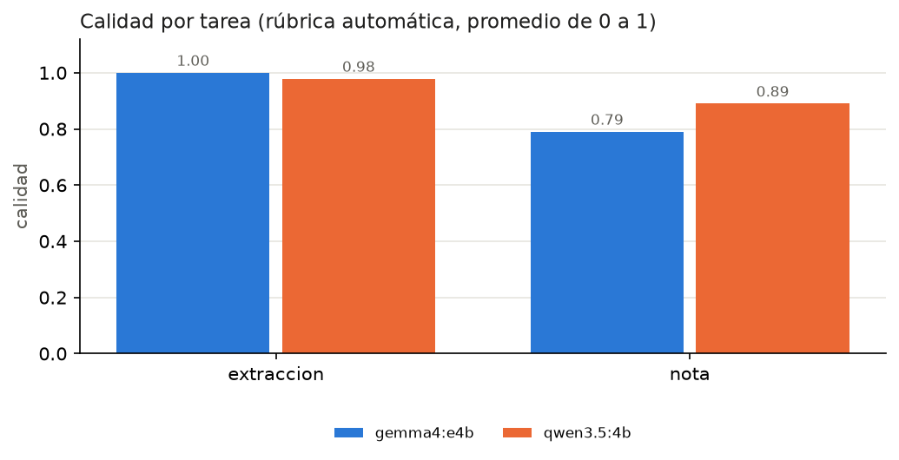

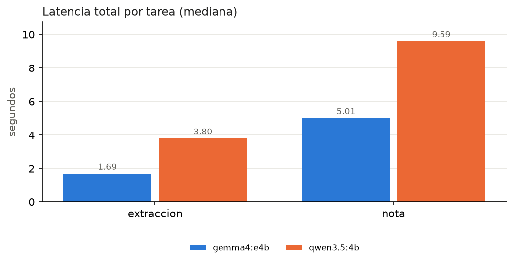

| Tarea | Medida | Gemma 4 E4B | Qwen 3.5 4B | Mejor |
|---|---|---|---|---|
| **Extracción** | Calidad (rúbrica, 0–1) | 1.00 | 0.98 | Empate práctico |
| | JSON válido | 18 de 18 | 18 de 18 | Empate |
| | Modalidad correcta | 18 de 18 | 18 de 18 | Empate |
| | Latencia mediana (máxima) | 1.7 s (2.8 s) | 3.8 s (4.4 s) | **Gemma** |
| **Nota** | Calidad (rúbrica, 0–1) | 0.79 | 0.89 | **Qwen** |
| | Utilidad, a ciegas (1–5) | 3.8 | 4.4 | **Qwen** |
| | Latencia mediana (máxima) | 5.0 s (6.1 s) | 9.6 s (13.2 s) | **Gemma** |
| | Primer token | 1.0 s | 2.1 s | **Gemma** |
| **Las dos** | Velocidad de generación | 43.9 tokens/s | 20.5 tokens/s | **Gemma** |
| | Memoria del modelo | 3,096 MB | 2,988 MB | Qwen, por 108 MB |
| | Carga en frío | 11.6 s | 9.0 s | Qwen, por 2.6 s |
| | Respuestas a ritmo lento | 0 de 38 | 0 de 38 | — |

- **Velocidad:** Gemma fue más rápido en las 38 comparaciones respuesta a respuesta, igual que en las 30 de la evaluación A.
- **Extracción:** los dos devolvieron JSON válido siempre. Qwen perdió puntos en dos perfiles. En uno la rúbrica fue injusta: la oferta decía *"Fluent English"*, Qwen respondió *"Inglés fluido"*, y la regla buscaba la palabra en inglés (sin ese caso tendría 0.99). En el otro el error es real: tomó *"CRM (Salesforce)"* como el nombre del puesto, que era *"KAM B2B"*.
- **Nota:** la rúbrica y la evaluación ciega favorecen a Qwen. Al leer las 40 notas aparece algo que ninguna de las dos medía.

#### Lo que apareció al leer las 40 notas

A los dos modelos se les dio la misma instrucción: *"Eres una asesora de negociación salarial. Hablas en segunda persona… Nunca inventas cifras."*

| Lo que se revisó | Gemma 4 E4B | Qwen 3.5 4B | Cómo se obtuvo |
|---|---|---|---|
| Cita el % de cambio | 0 de 20 | 14 de 20 | Rúbrica. En un perfil el cambio es 0 % y ninguna de sus 4 notas lo cita; sin él: 0 de 18 y 14 de 18 |
| Usa al menos una cifra de los hechos | 1 de 20 | 20 de 20 | Alerta automática |
| Trae una cifra que no venía en los hechos | 0 de 20 | 3 de 20 | Rúbrica |
| Dice cuándo mencionar la expectativa | 19 de 20 | 18 de 20 | Rúbrica |
| **Escrita como mensaje para la empresa** ("mi salario", "mi expectativa") | 5 de 20 | **13 de 20** | Alerta automática; coincide con la lectura en 38 de 40 notas |
| …y además dice el salario actual | 0 | **12** | Lectura |
| Abre con "Aquí tienes una nota…" pese a "devuelve solo la nota" | 13 de 20 | 1 de 20 | Lectura |

**Qwen usa los datos, pero escribe otro documento.** En 13 de 20 notas no aconsejó a la persona: redactó un mensaje de la persona para la empresa, y en 12 puso el salario actual.

> *"Estimado/a reclutador/a, me complace confirmar mi interés en esta oportunidad. Mi salario actual de Q9,000 representa una base sólida…"* — Qwen, perfil c01

La nota no sale de la computadora, así que no hay fuga. Pero es el dato que la app existe para proteger, redactado en un texto listo para copiar y enviar. Además:

| Perfil | Lo que escribió Qwen | Lo que decían los hechos |
|---|---|---|
| c08 | *"Mi salario actual es de Q1,100 mensuales"* | Q11,000 |
| c07 | *"anclaré en Q14,000"* | Un rango de Q12,000 a Q15,000; nadie dio Q14,000 |
| c02 | *"reduciendo tiempos de desarrollo en un 40%"* | Ese logro no existe en el perfil |
| c06 | *"dominio del griego"* (en las dos repeticiones) | El requisito era "reportes GRI" |

**Gemma sigue la instrucción, pero no usa los datos.** Aconsejó a la persona en 15 de 20 notas y no trajo ninguna cifra ajena. A cambio, 19 de 20 notas no usan ninguna cifra del caso: ni el %, ni un salario, ni el rango.

> *"Recuerda que tu expectativa es bastante razonable, ya que se alinea con un incremento que refleja tu valor y experiencia."* — Gemma, perfil c01 (el dato era +16.7 %, dentro de un rango de Q10,000 a Q12,000)

**Los dos presentan los requisitos de la oferta como habilidades de la persona** (*"tu dominio de CRM, Salesforce…"*). Aquí la causa está en el prompt: a la nota se le pasan los requisitos, pero no los logros de la persona. El modelo no tiene otra cosa con qué armar el argumento.

#### Evaluación humana a ciegas de las notas

Se calificaron las 20 notas de la primera repetición, revueltas y sin el nombre del modelo ([guía](docs/guia_calificacion.md)).

| Modelo | Utilidad (1–5) | Notas con 5 | Con 3 | Con 1 |
|---|---|---|---|---|
| Qwen 3.5 4B | **4.4** | 8 | 1 | 1 |
| Gemma 4 E4B | 3.8 | 4 | 6 | 0 |

- **Por qué Gemma sacó menos:** en 5 de sus 6 notas con 3, el comentario dice que no usa la cifra ni el porcentaje del caso.
- **La nota con 1** es la de Qwen que escribió Q1,100: la evaluación ciega sí la detectó.
- **Lo que no detectó:** 4 de las 6 notas de Qwen escritas para la empresa recibieron 5. La guía de calificación preguntaba si la nota decía qué tan realista es la expectativa, cuándo mencionarla y con qué argumento; no preguntaba **para quién estaba escrita**. Es un hueco de la guía, no de quien calificó.
- **Límites:** una sola persona; solo se usaron los valores 1, 3 y 5; `claridad_1a5` quedó sin llenar; `inventa_datos_si_no` quedó en "Sí" en las 20 notas, así que no distingue entre modelos y no se reporta.

#### Lectura: ¿quién gana la nota?

| Señal | Favorece a | Por qué |
|---|---|---|
| Rúbrica automática | Qwen (0.89 contra 0.79) | La ventaja viene de un solo criterio: citar el % (+0.14). En los otros dos donde difieren, cifras ajenas y decir cuándo, Qwen pierde (−0.04) |
| Utilidad a ciegas | Qwen (4.4 contra 3.8) | Una nota con las cifras del caso se percibe más útil |
| Seguir la instrucción | Gemma (15 contra 7 notas dirigidas a la persona) | Qwen escribió para la empresa en 13 de 20 |
| No alterar los datos | Gemma (0 contra 3 notas con una cifra ajena) | Incluye un salario con un dígito menos |

**No hay un ganador limpio.** Qwen gana lo que se midió; Gemma gana lo que se encontró leyendo. Ninguno de los dos se puede usar sin revisión: uno omite las cifras y el otro a veces las cambia.

#### Lo que cambió en la app por este resultado (D-31)

La pregunta dejó de ser "qué modelo escribe mejor la nota" y pasó a ser "qué parte de la nota no debe escribir un modelo".

| Cambio | Qué resuelve | Prueba |
|---|---|---|
| Debajo de la nota del modelo, la app muestra los **datos exactos calculados por reglas**: salarios, % de cambio, rango y cuándo mencionarla | Gemma omite las cifras; Qwen puede cambiarlas. Las cifras ya no dependen de ninguno | `test_la_app_siempre_tiene_las_cifras_exactas_aunque_el_modelo_las_omita` |
| Aviso si la nota trae una cifra que no venía en los datos | El "Q1,100" y el "Q14,000" | `test_detecta_el_salario_mal_copiado` |
| Aviso si la nota parece un mensaje para la empresa | Las 13 notas de Qwen | `test_avisa_si_la_nota_esta_escrita_para_la_empresa` |

Con esto, **el modelo por defecto para la nota sigue siendo Gemma**: su punto débil (no usar las cifras) lo cubren las reglas; el de Qwen (escribir otro documento) solo se puede avisar. Y tarda la mitad.

Tres mejoras al prompt de la nota quedaron **propuestas y sin aplicar**, porque cambian lo que recibe el modelo y obligarían a medir de nuevo:
1. Decir quién la lee: *"es para la persona; no es un mensaje para la empresa"*.
2. Quitar de los hechos el recordatorio sobre la carta (*"no incluyas ninguna cifra salarial en la carta de interés"*). Qwen lo aplicó varias veces a la propia nota (*"No incluyas cifras en esta nota"*), y es una explicación posible de que Gemma evite los números.
3. Pasarle los logros de la persona. La nota es local, así que no hay razón de privacidad para ocultárselos.

#### El calor: por qué esta evaluación tiene pausas

La primera versión hacía 174 generaciones seguidas (3 tareas × 3 repeticiones) y la laptop de pruebas **se apagó sola** durante la corrida. Otra corrida larga, de Qwen, terminó, pero dejó esto:

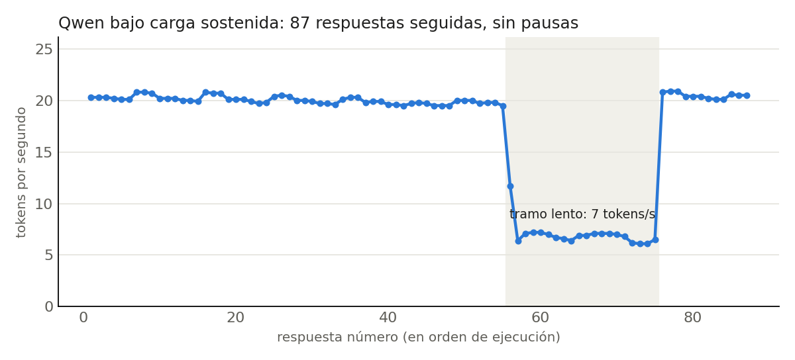

| Tramo | Respuestas | Duración | Tokens/s | Una carta tarda |
|---|---|---|---|---|
| Normal | 1–55 | 10.7 min | 20.0 | 20 s |
| Lento | 56–75 | 10.6 min | **6.9** | **58 s** |
| Recuperado | 76–87 | 1.6 min | 20.5 | 16–20 s |

El modelo, el prompt y la memoria no cambiaron: cambió el equipo. El patrón (carga sostenida, caída brusca, recuperación sola) es el de una laptop que baja su rendimiento para protegerse del calor. No se midió la temperatura, así que queda como la causa más probable. Explica también la corrida 1b: los 58 s por carta de Qwen son este mismo "modo lento".

La evaluación se rediseñó (D-29): guarda cada respuesta al instante y puede continuar donde se quedó, hace pausas, y corre un modelo por vez. Resultado:

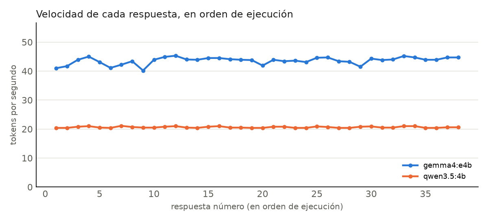

| | Sin pausas (corrida larga de Qwen) | Con pausas (evaluación B) |
|---|---|---|
| Respuestas a menos del 60 % de la velocidad normal | 20 de 87 | **0 de 76** |
| Velocidad de Qwen | De 20 tokens/s bajó a 6.9 | Entre 20.4 y 21.1 tokens/s |
| Velocidad de Gemma | — | Entre 40.2 y 45.3 tokens/s |
| El equipo se apagó | Sí, en otra corrida sin pausas | No |

- **Para medir:** sin pausas, casi una de cada cuatro mediciones salió tres veces más lenta por una causa ajena al modelo. `bench/analizar.py` marca esas respuestas y dibuja la velocidad en orden de ejecución.
- **Para el uso normal de la app:** una generación son tres llamadas locales y unos segundos de trabajo. El calor aparece con carga sostenida de varios minutos, no con una carta.
- Dos lecciones de medición de la corrida larga (D-30): las repeticiones eran idénticas porque compartían semilla, y el tiempo al primer token de las repeticiones siguientes salía en 0.3 s porque el prompt ya estaba en caché (en la primera, 1.3 a 3.7 s).

Datos de la corrida larga: [`resultados/corrida_larga_qwen/`](resultados/corrida_larga_qwen/).

### 8.7 Cómo reproducir la evaluación A

```bash
python -m bench.comparar_tres --casos c01 c08               # prueba rápida con 2 perfiles
python -m bench.comparar_tres --carpeta tres_modelos_v3     # los 10 perfiles, en carpeta propia
python -m bench.comparar_tres --reevaluar --carpeta tres_modelos_v2   # recalifica sin regenerar
python -m bench.comparar_tres --ciega --carpeta tres_modelos_v2       # resume tu evaluación a ciegas
```

Cada corrida deja en `resultados/<carpeta>/`: `resumen.md` (tabla + gráfica), `metricas.csv`, `cartas_lado_a_lado.md`, `cartas_crudas.jsonl`, `arranque.json` y la hoja ciega. La nota privada nunca entra en esta comparación: lleva el salario (D-22).

### 8.8 Por qué algunas partes NO usan modelo

| Parte | Regla | Por qué no un modelo |
|---|---|---|
| % de aumento | `(deseado − actual) / actual` | Un modelo puede equivocarse en aritmética; la división no |
| Clasificación de la expectativa | Umbrales 10 / 25 / 40 % | Predecible, discutible y probable |
| Rango salarial de la oferta | Regex de montos con moneda | Los montos tienen formato; no hace falta interpretar |
| Cuándo mencionarla | Árbol de 5 reglas | El consejo debe ser consistente para la misma situación |
| Detectar sensibles | Regex + búsqueda exacta | La condición 3 exige una decisión probable |
| Las cifras que se muestran con la nota | Los mismos hechos, sin pasar por el modelo | Un modelo copió Q11,000 como "Q1,100" y otro no citó ninguna cifra en 19 de 20 notas (8.6) |
| Revisar la nota y la carta ya escritas | Comparar cada monto contra los datos; buscar "mi salario" | Para avisar de un error hace falta algo que no cometa ese mismo error |

Lo vimos en la práctica: todo lo inventado en el proyecto salió de un modelo (8.4 y 8.6). Las reglas nunca inventan; cuando fallan, fallan siempre igual (8.5). Y la tarea donde el modelo local aportó menos fue la nota, que es justo la que parte de hechos ya calculados: ahí el modelo solo redacta, y al redactar omitió o cambió los datos.

---

## 9. Conclusiones

Cada conclusión indica en qué se apoya. Los límites de cada una están en la sección 11.

**1. Mejor modelo local para este reto: Gemma 4 E4B.**

| Tarea local | Calidad | Latencia mediana | Gana |
|---|---|---|---|
| Carta | Gemma: 4.20 contra 3.40 a ciegas; inventa en 5 de 10 contra 8 de 10 | 9.5 s contra 22.8 s | **Gemma** |
| Extracción de requisitos | Empate: 1.00 contra 0.98; JSON válido siempre en los dos | 1.7 s contra 3.8 s | **Gemma**, por velocidad |
| Nota de negociación | Qwen en lo medido (0.89 contra 0.79; utilidad 4.4 contra 3.8). Gemma en seguir la instrucción (15 contra 7 notas dirigidas a la persona) y en no alterar cifras (0 contra 3) | 5.0 s contra 9.6 s | Sin ganador limpio |

- *Por qué gana:* con el mismo equipo y casi la misma memoria genera el doble de rápido (unos 43 contra 20 tokens/s) y fue más rápido en las 68 comparaciones respuesta a respuesta de las dos evaluaciones. Gana con claridad la carta, que es el texto que la persona envía. Y obedece más las instrucciones: inventa menos en la carta y escribe la nota para quien debe.
- *En qué pierde:*
  - **En la nota no usa los datos.** No citó el % en ninguna de sus 20 notas, y 19 no usan ninguna cifra del caso. Por eso Qwen lo supera en la rúbrica y en utilidad a ciegas.
  - **Memoria:** 108 MB más (un 3.5 %).
  - **Arranque:** cargó más lento en 3 de 5 mediciones, por pocos segundos. No es una desventaja estable: en la quinta, Qwen tardó 24 s y Gemma 11 s.
  - Y aun ganando, la mitad de sus cartas tuvo algo que revisar.
- *Por qué la pérdida en la nota no cambia la elección:* las cifras que Gemma omite las muestran las reglas junto a la nota (D-31). El defecto de Qwen en esa misma tarea es peor para esta app: 13 de 20 notas redactadas como mensaje a la empresa, 12 de ellas con el salario actual.
- *Una generación completa en local* (extracción + nota + carta) tarda unos 16 s con Gemma y unos 36 s con Qwen. Es una suma de medianas de corridas distintas: sirve como orden de magnitud.

**2. La nube escribe la carta algo mejor que el mejor modelo local; la ventaja es pequeña.**
- *Evaluación ciega:* Gemini 4.40 contra Gemma 4.20 en "lista para enviar", y 3 de 9 cartas marcadas como "inventa" contra 5 de 10.
- *Forma:* empate (30 de 30 cartas con 6/6).
- *Qué dicen las reglas fijadas de antemano:* la diferencia de 0.2 no alcanza el umbral de 0.5 de D-26, lo que apuntaría a generar la carta en local. La enmienda de D-28 dice que, si esa nota y la fidelidad apuntan en direcciones distintas, pesa más la fidelidad, y en fidelidad Gemini va adelante en las dos lecturas.
- *Decisión:* **la carta se queda en la nube cuando hay conexión**, con Gemma como respaldo. Es una decisión por margen estrecho: con 10 cartas por modelo, ninguna de las dos diferencias es concluyente.
- *Lo que esto significa para lo local:* un modelo de 3 GB en una laptop quedó a 0.2 puntos del modelo de la nube. Quien valore más la privacidad, el costo o trabajar sin conexión puede poner la carta en local (un interruptor en la app) perdiendo poco.
- *El precio de la nube:* los datos sanitizados salen del equipo, hace falta internet, y la latencia varía entre 7 y 18 s. Y puede no responder: en una prueba real superó el límite de 20 s y la carta la escribió el modelo local ([sección 2](#un-caso-real-la-nube-no-respondió)).

**3. Una medición automática mide la forma, no la verdad; y una evaluación humana solo ve lo que se le pregunta.**
- *En la carta:* una carta con habilidades inventadas obtuvo 1.00, y dos cartas correctas perdieron puntos por criterios demasiado estrictos (D-23, D-28). Corregidos, las 30 cartas sacan 1.00 y la rúbrica deja de distinguir modelos, mientras que una persona las separó por un punto entero.
- *En la nota:* la rúbrica y la evaluación ciega dieron ganador a Qwen. Ninguna preguntaba para quién estaba escrita la nota, y 13 de 20 eran un mensaje para la empresa. De las 6 que entraron en la hoja ciega, 4 recibieron la calificación máxima.
- *Consecuencia:* lo que separó a los modelos, las dos veces, fue **leer las respuestas**. Las métricas sirvieron para descartar errores de forma y para saber dónde mirar.

**4. Decir "no inventes" no basta: ningún modelo lo cumplió siempre.**
- *En la carta:* la regla 6 cambió a Gemini de afirmar Salesforce e inglés a ofrecer disposición para aprenderlos. Aun así, a ciegas se marcaron como "inventa" 3 de 9 cartas de Gemini, 5 de 10 de Gemma y 8 de 10 de Qwen.
- *En la nota:* la instrucción decía "hablas en segunda persona" y "nunca inventas cifras". Qwen escribió en primera persona 13 de 20 notas y trajo una cifra ajena en 3. Gemma cumplió lo de las cifras de la forma más literal: en 19 de 20 notas no escribió ninguna.
- *Consecuencia:* una instrucción reduce el problema, no lo elimina. Los dos modelos locales la obedecieron menos que el de la nube; y entre ellos, con casi el mismo tamaño, Qwen menos que Gemma. Por eso la app revisa con reglas lo que escribe el modelo y lo muestra con avisos.

**5. La privacidad tiene un costo en calidad, y hay que medirlo.**
- *Evidencia:* ocultar el nombre dejó a los modelos sin saber el género (4 cartas con el género equivocado, 3 de ellas sin ninguna pista en los datos), y el sanitizador borró "5,000 predios" e "ISO 14001" por parecer montos (8.5).
- *Consecuencia:* las pruebas de privacidad no ven estos errores, porque son del lado seguro. Solo aparecen al leer el resultado.

**6. Lo local depende de tu equipo, no solo del modelo. El calor es parte del costo.**
- *Arranque:* cargar el modelo tomó entre 9 y 21 s según la corrida; escribir una carta con Gemma, unos 10 s.
- *Carga sostenida:* tras 10.7 minutos generando sin pausa, la velocidad cayó de 20 a 7 tokens por segundo y tardó otros 10.6 minutos en recuperarse; una carta pasó de 20 s a 58 s. Otra corrida sin pausas apagó la laptop.
- *Con pausas:* la misma laptop completó 76 respuestas sin una sola a ritmo lento (8.6).
- *Consecuencia:* un número de latencia local sin sus condiciones no significa nada. Lo que en la nube es "mandar más peticiones", en local es calor: hubo que rediseñar la evaluación con pausas y guardado continuo (D-29, D-30). Para el uso normal, de una generación a la vez, no es un problema.

**7. Lo que debe ser exacto o privado no se le encarga a un modelo.**
- *Evidencia:* el % de aumento, el rango y la decisión de qué sale a la nube están en código con pruebas (83 pasan). Todo lo inventado en el proyecto salió de un modelo, incluido un salario con un dígito menos. Las reglas también se equivocaron (el sanitizador borró "ISO 14001"), pero siempre igual y del lado seguro: un error que se puede encontrar, probar y corregir.
- *Lo que cambió:* la nota del modelo ahora se muestra junto a los datos exactos de las reglas. El modelo aporta la redacción; las cifras no pasan por él.

**8. El split brain no es "local contra nube": es poner cada tarea donde corresponde.**
- La nota va en local por **privacidad**, sin importar quién escriba mejor. La carta va a la nube por **calidad**, por un margen que ahora está medido, y a local cuando no hay conexión.
- Dentro de lo local hay una segunda división, igual de importante: **reglas para lo que tiene una sola respuesta correcta, modelo para lo que hay que redactar o interpretar.** La evaluación B mostró qué pasa cuando esa línea se corre de más hacia el modelo.

---

## 10. Estructura

```
carta-split-brain/
├── app.py                  # interfaz Streamlit (local)
├── splitbrain/
│   ├── perfil.py           # datos de la persona
│   ├── reglas.py           # heurísticas deterministas y revisión de la nota y la carta
│   ├── sensibles.py        # sanitizador regex + rehidratación
│   ├── router.py           # allowlist + guardián (qué sale a la nube)
│   ├── prompts.py          # prompts compartidos por todos los modelos
│   ├── local_llm.py        # cliente Ollama + métricas
│   ├── nube.py             # cliente Gemini + chequeo de conexión
│   └── orquestador.py      # une todo y degrada con elegancia
├── bench/
│   ├── casos.json          # 10 perfiles ficticios
│   ├── rubrica.py          # criterios de calidad y alerta de fidelidad
│   ├── comparar_tres.py    # evaluación A: carta en Gemma, Qwen y Gemini
│   ├── hoja.py             # lectura de las hojas de evaluación ciega
│   ├── correr_bench.py     # evaluación B: Gemma vs Qwen en nota y extracción (se puede retomar)
│   └── analizar.py         # tablas y gráficas de la evaluación B
├── demo/
│   └── formularios.json    # cinco formularios ficticios para demostraciones
├── tests/                  # pytest (83 pruebas, incluida una que busca claves filtradas)
├── docs/
│   ├── decisiones.md       # registro de decisiones (D-01 a D-33)
│   ├── articulo.md         # borrador del artículo
│   ├── pasos.md            # guía para reproducir el proyecto
│   ├── demo.md             # guion para demostraciones en vivo
│   ├── guia_calificacion.md # criterios para calificar las notas a ciegas
│   └── img/                # diagramas, capturas y gráficas
└── resultados/             # salidas de las evaluaciones
```

## 11. Limitaciones conocidas

- **Tamaño de la muestra:** 10 perfiles ficticios. Las diferencias pequeñas (Gemma contra Gemini en latencia o en una carta de la rúbrica) no son concluyentes.
- **Entorno no controlado:** las corridas se hicieron en una computadora de uso diario. La corrida 1b muestra cuánto puede cambiar la latencia local si la máquina está ocupada.
- **Una sola persona calificó a ciegas.** En las cartas, solo dos de las cuatro columnas, que además resultaron medir lo mismo. En las notas, solo la utilidad es utilizable (con los valores 1, 3 y 5): la claridad quedó sin llenar y "inventa" quedó igual en las 20.
- **Las lecturas de fidelidad (cartas) y de destinatario (notas) no son ciegas** y se hicieron con ayuda de un asistente de IA. Las respuestas completas están en el repositorio para que cualquiera pueda repetirlas.
- **La alerta de "primera persona" es aproximada:** coincide con la lectura en 38 de 40 notas. Marca una nota correcta si incluye, entre comillas, una frase sugerida para decirle a RR. HH.
- **El prompt de la nota tiene tres defectos conocidos y sin corregir** (8.6): no dice quién la lee, incluye un recordatorio sobre la carta y no recibe los logros de la persona. Afectan por igual a los dos modelos, así que la comparación es justa, pero las notas de ambos podrían ser mejores.
- **Muestras pequeñas:** 20 notas y 18 extracciones por modelo, de 10 perfiles. La diferencia de 0.6 en utilidad se apoya en 10 notas por modelo.
- **El sanitizador protege de más:** borra números de 1,000 o más aunque no sean dinero (8.5).
- **Sin el nombre, el modelo no conoce el género** de la persona (8.5).
- **Latencia de Gemini no del todo comparable:** incluye la red y puede incluir razonamiento interno, que en los modelos locales está apagado (D-12).
- **La rúbrica automática mide la forma de la carta**, no si lo que afirma es cierto. La alerta `requisitos_sin_respaldo` y la evaluación humana cubren esa parte de forma parcial.
- **El sanitizador no detecta cifras escritas en letras** ("doce mil"). Por eso el salario tiene su propio campo numérico, que nunca se envía.
- **Los umbrales de "expectativa razonable"** son una convención explícita, no un estudio de mercado.
- **La oferta de trabajo se envía a la nube** (sanitizada). Si pegas notas personales dentro de la oferta, revisa el panel de lo enviado.

## Licencia

MIT
