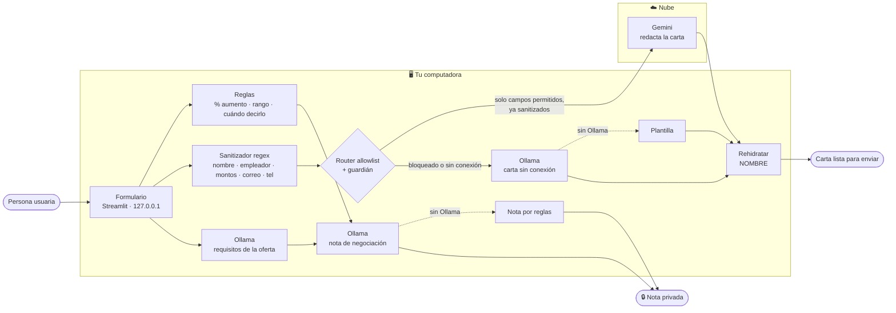

# ✉️ Carta Split Brain

App que genera una **carta de interés** para acompañar tu CV y una **nota privada de negociación salarial**, con una arquitectura *split brain*: una parte corre en tu computadora (reglas + un modelo local con Ollama) y otra en la nube (Gemini).

> **Tu salario nunca sale de tu computadora.** Hay pruebas automatizadas que lo demuestran.

- 🎥 **Demo:** _[pegar aquí el link del video]_
- 📝 **Artículo:** _[pegar aquí el link de Medium/Substack]_
- 🧭 **Todas las decisiones y su porqué:** [`docs/decisiones.md`](docs/decisiones.md)
- 📊 **Benchmark Gemma vs Qwen:** [`resultados/resumen.md`](resultados/resumen.md)
- 🪜 **Guía paso a paso:** [`docs/pasos.md`](docs/pasos.md)

---

## 1. Qué corre dónde y por qué



| Tarea | Dónde | Con qué | Razón |
|---|---|---|---|
| % de aumento, clasificación, rango de la oferta, cuándo mencionarlo | 🖥️ Local | Reglas | ⚡ latencia · 🎯 exactitud · 📴 sin conexión |
| Detectar datos sensibles y decidir qué sale | 🖥️ Local | Regex + allowlist | 🔒 privacidad (condición 3: explícito y probable) |
| Extraer requisitos de la oferta | 🖥️ Local | Ollama | ⚡ · 📴 · 💰 |
| Nota de negociación | 🖥️ Local | Ollama → reglas | 🔒 usa el salario · 📴 |
| Carta de interés | ☁️ Nube | Gemini | 🎯 mejor redacción · 💰 capa gratuita |
| Carta sin conexión | 🖥️ Local | Ollama → plantilla | 📴 |

**Qué nunca sale:** nombre, empleador actual, salario actual, salario deseado, moneda (`CAMPOS_SOLO_LOCAL` en `splitbrain/router.py`). Lo que sí sale pasa por el sanitizador y por un guardián que **falla cerrado**. En la app, el panel *"Exactamente lo que salió a la nube"* muestra el JSON enviado.

Detalle completo y alternativas descartadas: [`docs/decisiones.md`](docs/decisiones.md).

---

## 2. Requisitos

- Python 3.11 o superior
- [Ollama](https://ollama.com/download) instalado y corriendo
- Unos 8 GB de RAM libres para un modelo de ~4B
- (Opcional) una API key gratuita de Gemini desde [Google AI Studio](https://aistudio.google.com/apikey). Sin ella la app funciona en modo local.

## 3. Instalación paso a paso

```bash
# 1. Clonar
git clone https://github.com/<tu-usuario>/carta-split-brain.git
cd carta-split-brain

# 2. Entorno virtual
python -m venv .venv
source .venv/bin/activate          # Windows: .venv\Scripts\activate

# 3. Dependencias
pip install -r requirements.txt

# 4. Modelos locales (verifica las etiquetas en https://ollama.com/library)
ollama pull gemma4:e4b
ollama pull qwen3.5:4b
ollama list                        # confirma que aparecen

# 5. Variables de entorno
cp .env.example .env               # Windows: copy .env.example .env
# abre .env y pega tu GEMINI_API_KEY
```

## 4. Correr la app

```bash
streamlit run app.py
```

Se abre en `http://127.0.0.1:8501`. Para probar **sin conexión**, apaga el interruptor *"Usar la nube para la carta"*, desconecta el wifi, o arranca con:

```bash
FORZAR_SIN_CONEXION=1 streamlit run app.py      # Windows (PowerShell): $env:FORZAR_SIN_CONEXION=1
```

## 5. Correr las pruebas

```bash
pytest -v
```

No necesitan Ollama ni internet: usan clientes falsos que **registran todo lo que recibirían**. Las que demuestran las condiciones del reto:

| Condición | Prueba |
|---|---|
| El salario nunca sale | `tests/test_privacidad.py::test_lo_que_recibe_la_nube_no_tiene_salario` |
| El guardián atrapa el salario en 10 formatos (`12,500`, `12.5k`, `12.5 mil`, ×12, ×14…) | `test_guardian_atrapa_el_salario_en_cualquier_formato` |
| La decisión de qué sale es explícita | `tests/test_router.py::test_todo_campo_esta_clasificado_una_sola_vez` |
| Sin conexión sigue siendo útil | `tests/test_offline.py` |

---

## 6. Cómo se llama al componente local (Ollama)

Ollama expone una API REST en `http://127.0.0.1:11434`. La app usa `/api/chat` con streaming:

```bash
curl http://127.0.0.1:11434/api/chat -d '{
  "model": "gemma4:e4b",
  "messages": [{"role": "user", "content": "Hola"}],
  "stream": false,
  "think": false,
  "options": {"temperature": 0.2, "seed": 42, "num_ctx": 4096}
}'
```

Desde Python (`splitbrain/local_llm.py`):

```python
from splitbrain.local_llm import ClienteOllama

cliente = ClienteOllama("gemma4:e4b")
g = cliente.generar("Escribe una frase de prueba", sistema="Responde en español")
print(g.texto)
print(g.metricas)   # latencia_total_s, ttft_s, tokens_por_s, carga_modelo_s, rss_pico_mb, ps_size_mb...
```

Otros endpoints usados: `/api/tags` (¿está el modelo?), `/api/ps` (memoria del modelo cargado) y `/api/generate` con `keep_alive: 0` (descargar el modelo entre corridas del benchmark).

## 7. Cómo se llama a la API en la nube (Gemini)

`splitbrain/nube.py` usa el SDK oficial `google-genai`. **Solo recibe un `PayloadNube` que ya pasó por `router.preparar_envio()`.**

```python
from google import genai
from google.genai import types

cliente = genai.Client(api_key=GEMINI_API_KEY,
                       http_options=types.HttpOptions(timeout=20000))
resp = cliente.models.generate_content(
    model="gemini-flash-latest",
    contents=prompt_carta(payload.campos),
    config=types.GenerateContentConfig(system_instruction=SISTEMA_CARTA, temperature=0.7),
)
```

- **Credencial:** `GEMINI_API_KEY` en `.env` (está en `.gitignore`; nunca se sube).
- **Si falla o tarda más de 20 s:** se lanza `NubeNoDisponible` y la carta se genera con el modelo local.
- **Qué se envía:** puesto actual, puesto y empresa objetivo, experiencia, logros, oferta y tono, todo sanitizado.

---

## 8. Benchmark: Gemma vs Qwen

Evalúa los modelos locales en las **tres tareas locales de la app** (nota, carta sin conexión y extracción de requisitos) con 10 perfiles ficticios (`bench/casos.json`), los mismos prompts y las mismas opciones.

```bash
# (opcional) verificar el pipeline sin Ollama; sus números NO son resultados
python -m bench.correr_bench --simulado

# corrida real (~20–40 min según tu equipo)
python -m bench.correr_bench --modelos gemma4:e4b qwen3.5:4b --reps 3

# califica a ciegas resultados/evaluacion_ciega.csv (columnas 1–5) y luego:
python -m bench.analizar
```

| Métrica | Cómo se mide |
|---|---|
| Calidad | Rúbrica automática por tarea (`bench/rubrica.py`) + evaluación humana ciega |
| Latencia | Total, tiempo al primer token (TTFT), p95, tokens/s, arranque en frío |
| Memoria | RSS pico de los procesos de Ollama (psutil, cada 100 ms) + `size`/`size_vram` de `/api/ps` |

Resultados y conclusión: [`resultados/resumen.md`](resultados/resumen.md).

### Por qué algunas partes NO usan modelo

| Parte | Regla | Por qué no un modelo |
|---|---|---|
| % de aumento | `(deseado − actual) / actual` | Un modelo puede equivocarse en aritmética; la división no |
| Clasificación de la expectativa | Umbrales 10 / 25 / 40 % | Predecible, discutible y probable |
| Rango salarial de la oferta | Regex de montos con moneda | Los montos tienen formato; no hace falta interpretar |
| Cuándo mencionarla | Árbol de 5 reglas | El consejo debe ser consistente para la misma situación |
| Detectar sensibles | Regex + búsqueda exacta | La condición 3 exige una decisión probable |

---

## 9. Estructura

```
carta-split-brain/
├── app.py                  # interfaz Streamlit (local)
├── splitbrain/
│   ├── perfil.py           # datos de la persona
│   ├── reglas.py           # heurísticas deterministas
│   ├── sensibles.py        # sanitizador regex + rehidratación
│   ├── router.py           # allowlist + guardián (qué sale a la nube)
│   ├── prompts.py          # prompts compartidos por todos los modelos
│   ├── local_llm.py        # cliente Ollama + métricas
│   ├── nube.py             # cliente Gemini + chequeo de conexión
│   └── orquestador.py      # une todo y degrada con elegancia
├── bench/                  # casos, rúbrica, benchmark y análisis
├── tests/                  # pytest
├── docs/decisiones.md      # registro de decisiones
└── resultados/             # salidas del benchmark
```

## 10. Limitaciones conocidas

- El sanitizador no detecta cifras escritas en letras ("doce mil"). Por eso el salario tiene su propio campo numérico, que nunca se envía.
- Los umbrales de "expectativa razonable" son una convención explícita, no un estudio de mercado.
- La oferta de trabajo se envía a la nube (sanitizada). Si pegas notas personales dentro de la oferta, revisa el panel de lo enviado.

## Licencia

MIT
