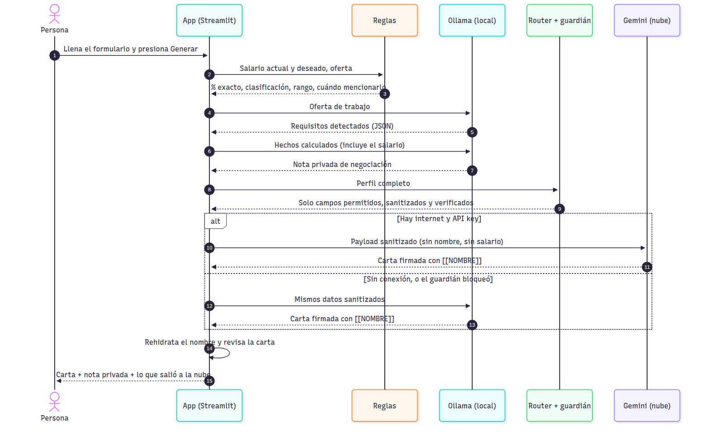

# Tu salario no tiene por qué viajar a la nube: cómo construí una app "split brain" con modelos locales

*Borrador · Para publicar en Medium/Substack · Las marcas ⟦PENDIENTE⟧ se llenan con los resultados reales del benchmark y las capturas.*

---

## El problema: le estás contando todo a un servidor

Imagina que vas a pedirle ayuda a una IA para escribir tu carta de presentación. Para que te aconseje bien, le cuentas lo que ganas hoy, cuánto quieres ganar y en qué empresa trabajas. Todo eso viaja a un servidor que no controlas.

Ahora imagina otra opción: la parte de la app que necesita saber tu salario corre **en tu computadora**, y a la nube solo va lo que de verdad necesita para redactar bien. Eso es una arquitectura **split brain** ("cerebro dividido"): una mitad piensa en tu dispositivo y la otra en la nube.

En este artículo te cuento cómo construí una app así en Python, qué encontré al comparar dos modelos locales (Gemma y Qwen) contra uno en la nube (Gemini) y en qué me equivoqué por el camino. Adelanto: mis mediciones me dieron la razón, pero por un motivo distinto al que yo tenía.

⟦CAPTURA: la app con la carta a la izquierda y la nota privada a la derecha⟧

## Qué hace la app

Le cuentas tu situación con franqueza: qué haces, cuánto ganas, qué quieres y cuánto quieres ganar. Si quieres, pegas la oferta. La app te devuelve:

1. **Una carta de interés**, lista para enviar con tu CV.
2. **Una nota privada de negociación**, solo para ti: qué tan realista es tu expectativa y cuándo te conviene mencionarla. Esta nota nunca sale de tu computadora.

## Split brain en una imagen


Fíjate en la flecha naranja: es el **único** punto donde algo sale de tu computadora, y lo que viaja ya pasó por un filtro.

La pregunta central es: **¿qué va dónde, y por qué?** Hay cinco buenas razones para mandar algo a un lado o al otro:

- 🔒 **Privacidad:** hay datos que no deben salir del dispositivo.
- ⚡ **Latencia:** hay respuestas que no pueden esperar un viaje por la red.
- 💰 **Costo:** no toda petición merece una llamada a una API de pago.
- 📴 **Disponibilidad:** sin internet, la app debe seguir sirviendo.
- 🎯 **Calidad:** hay tareas que un modelo pequeño no resuelve bien.

Mi reparto quedó así:

| Tarea | Dónde | Por qué |
|---|---|---|
| Calcular tu % de aumento y si es realista | Tu computadora, con **reglas** | ⚡ 🎯 📴 |
| Detectar tu nombre, salario, correo… | Tu computadora, con **regex** | 🔒 |
| Escribir la nota de negociación | Tu computadora, con un **modelo local** | 🔒 usa tu salario |
| Escribir la carta | **Nube** (Gemini) | 🎯 supuse que escribe mejor · 💰 capa gratuita |
| Escribir la carta sin internet | Tu computadora | 📴 |

Lo curioso: aunque la nube escribiera mejor, **la nota no iría a la nube**. La nota necesita tu salario, y ahí la privacidad le gana a la calidad. Esa es la esencia del split brain: no hay un lado "mejor", hay un lado correcto para cada tarea.

Y fíjate en la palabra "supuse" de la tabla. Más abajo la pongo a prueba.

## Cómo funciona, paso a paso



En palabras:

1. **Llenas el formulario.** El salario va en sus propios campos numéricos.
2. **Las reglas calculan los hechos:** el % exacto de aumento, si es conservador o ambicioso, el rango que publica la oferta y cuándo te conviene mencionarlo. Sin modelo.
3. **El modelo local lee la oferta** y saca los requisitos.
4. **El modelo local redacta tu nota privada** con esos hechos. Aquí sí se usa tu salario, y por eso no sale de tu computadora.
5. **El sanitizador limpia** lo que sí puede viajar: cambia tu nombre por `[[NOMBRE]]` y los montos por `[MONTO]`.
6. **El router y el guardián** arman el envío con los campos permitidos y revisan que no se haya colado nada.
7. **Gemini redacta la carta** con datos limpios. Si no hay internet, la redacta el modelo local.
8. **Tu computadora vuelve a poner tu nombre** y te muestra la carta, la nota y exactamente lo que salió a la nube.

## Lección 1: lo local no siempre es un modelo

Mi primer impulso fue pedirle todo al modelo local: "calcula cuánto aumento es pasar de Q12,500 a Q16,000 y dime si es razonable". Pero un modelo de 4 mil millones de parámetros puede equivocarse en una resta, y yo no tengo forma de garantizar que no lo haga.

Así que dividí el trabajo:

```python
# reglas.py — esto NUNCA lo hace un modelo
pct = (deseado - actual) / actual * 100      # 28.0 %, siempre
clasificacion = clasificar_incremento(pct)   # "ambiciosa"
```

Y el modelo solo **redacta** a partir de esos hechos ya calculados. Si en la nota aparece una cifra que no vino de las reglas, mi rúbrica la marca como **cifra inventada**.

Regla práctica: **si la respuesta tiene una única respuesta correcta, no uses un modelo.** Porcentajes, rangos, formatos, validaciones: código. Redactar, resumir, entender lenguaje libre: modelo.

## Lección 2: quién decide qué sale a la nube

Una tentación peligrosa es pedirle al modelo local que "limpie" los datos sensibles antes de enviarlos. El problema: un modelo es probabilístico. Puede hacerlo bien 99 veces y fallar la número 100, y con tu salario no hay margen.

Por eso la decisión la toma **código explícito**, en tres capas:

1. **Lista de permitidos:** solo viajan los campos que alguien decidió que viajan. Si mañana agrego un campo "teléfono" y olvido clasificarlo, **no sale**, y además una prueba se pone en rojo hasta que lo decida.
2. **Sanitizador:** reemplaza tu nombre por `[[NOMBRE]]`, tu empresa por `[[EMPLEADOR_ACTUAL]]` y cualquier monto por `[MONTO]`.
3. **Guardián:** revisa el paquete final. Si encuentra tu salario (en cualquier formato), bloquea el envío y la carta se hace en local.

⟦CAPTURA: el panel "Exactamente lo que salió a la nube" con el JSON sanitizado⟧

Y la nube escribe `[[NOMBRE]]` al firmar. Tu computadora lo cambia por tu nombre real al final. La carta sale firmada sin que la nube sepa quién eres.

## El error que me enseñó más

⟦Elegir UNO o DOS para el artículo; todos ocurrieron al construir la app⟧

**Opción A — Los años que parecían teléfonos.** Mi regex para teléfonos guatemaltecos buscaba el patrón `dddd-dddd`. Al escribir las pruebas con un perfil ficticio que decía "trabajé de 2019-2023", el sanitizador lo convertía en `[TELÉFONO]`. La carta perdía información útil por proteger algo que no era sensible. Lo corregí con una excepción para rangos de años, y ahora hay una prueba que lo vigila. Moraleja: **una regla de privacidad también tiene falsos positivos, y cuestan calidad.**

**Opción B — El salario disfrazado de logro.** Un perfil de prueba decía "ahorré Q150,000 al año". Suena inocente, pero es exactamente 12 × Q12,500: el salario anual. En Guatemala además se habla de salario ×14 (aguinaldo y bono 14). Desde entonces el guardián compara contra el monto mensual, ×12 y ×14.

**Opción C — La carta que decía "cobro [MONTO]".** Todas mis pruebas de privacidad pasaban. Entonces corrí la app de punta a punta, sin internet y sin Ollama, para ver el peor caso. La carta decía: *"llevo 5 años en mi empresa y cobro [MONTO]. Tel [TELÉFONO]"*. Mi sistema protegía perfectamente el dato… y dejaba el hueco a la vista. Las pruebas revisaban que nada sensible saliera, pero ninguna revisaba que la carta se pudiera enviar. Ahora las frases con datos censurados se eliminan antes de redactar, y hay una prueba para eso. Moraleja: **probar la privacidad no es lo mismo que probar la experiencia.**

**Opción D — Medí la carga del modelo creyendo que medía su velocidad.** En mi primera prueba real, Qwen tardó 33.5 s en un perfil y 13.3 s en el siguiente. ¿El primer perfil era más difícil? No: la primera vez que usas un modelo local, Ollama tiene que cargarlo del disco a la memoria, y yo estaba cronometrando eso también. Además mi script alternaba entre modelos en cada perfil. Lo corregí: ahora cada modelo corre todos los perfiles seguidos, después de una llamada de "calentamiento" que no se mide, y el arranque en frío se reporta aparte. Moraleja: **en modelos locales, la primera respuesta y las siguientes son dos números distintos, y hay que decir cuál estás mostrando.**

**Opción E — Mi regla castigó una despedida correcta y dejó pasar una mentira.** ⭐ *(recomendada: es la más propia de este proyecto)*

En mi primera prueba, el único punto perdido fue de Gemini, el modelo de la nube: falló el criterio "saludo y despedida". Estuve a punto de escribir "la nube falló". Antes fui a leer la carta. Terminaba así:

> *Un cordial saludo,*
> *José Ángel Barrios*

Una despedida impecable. El problema era mío: mi regla buscaba "saludos", "atentamente", "cordialmente" o "gracias", y "Un cordial saludo" no coincide con ninguna. **Falló la regla, no el modelo.**

Pero ya que estaba leyendo, vi algo peor. Mi perfil ficticio decía solo esto: ejecutivo de ventas, cinco años, cerró contratos en 2024. La oferta pedía Salesforce e inglés. Y la carta decía:

> *"Cuento con experiencia en el uso de Salesforce… Me comunico con fluidez en inglés."*

Nadie le dijo eso al modelo. Tomó los requisitos de la oferta y se los atribuyó a la persona:

| Requisito de la oferta | ¿Estaba en el perfil? | Lo que la carta afirmó | Gravedad |
|---|---|---|---|
| CRM (Salesforce) | ❌ No | "Cuento con experiencia en el uso de Salesforce…" | 🔴 Inventado |
| Inglés | ❌ No | "Me comunico con fluidez en inglés" | 🔴 Inventado |
| Negociación, B2B | ❌ No, aunque es razonable en ventas | "…habilidades de negociación… en el entorno B2B" | 🟡 Supuesto plausible |
| Remoto | ❌ No | "Poseo la autogestión y disciplina… en esquemas a distancia" | 🟡 Supuesto plausible |
 Esa carta sacó **nota perfecta** en mi rúbrica corregida, porque ningún criterio revisaba si lo que afirmaba era cierto.

O sea: mi sistema de calidad le quitó puntos a una despedida correcta y le dio nota perfecta a una carta que inventaba un idioma. Lo arreglé en tres capas: una regla nueva en el prompt ("los requisitos de la oferta no son experiencia de la persona"), una alerta automática que marca esas cartas para revisión, y una columna en mi evaluación humana.

Moraleja: **una métrica automática te dice si el texto tiene la forma correcta, no si dice la verdad. Para eso hay que leer.**

⟦Agregar aquí cualquier error que aparezca al correr el benchmark real, por ejemplo: un modelo que ignoró el marcador [[NOMBRE]], o que devolvió JSON inválido⟧

## ¿De verdad la nube escribe mejor? Lo puse a prueba

Mi diseño manda la carta a la nube "porque escribe mejor". Era una suposición. Para probarla generé la misma carta con los tres modelos: **Gemma 4 (E4B)** y **Qwen 3.5 (4B)** en mi computadora, y **Gemini** en la nube.

Para que fuera justo:

- Los mismos 10 perfiles ficticios, con casos difíciles a propósito: datos sensibles escondidos en el texto, una oferta en inglés, alguien que pide menos de lo que gana.
- Las mismas instrucciones y la misma temperatura para los tres.
- A Gemini le llegó lo mismo que le llega en la app: los datos ya limpios.
- Un modelo a la vez, con una primera llamada de "calentamiento" que no se mide.

La nota privada no entró en la comparación: lleva el salario, y esa regla no tiene excepciones ni para hacer pruebas.

Corrí todo tres veces. En total, 90 cartas.


### Los números (corrida de referencia)


| Modelo | Dónde | Mi nota a ciegas (1–5) | Cartas que inventan | Forma (rúbrica) | Latencia mediana | Mín–máx | Tokens/s | Memoria |
|---|---|---|---|---|---|---|---|---|
| Gemma 4 E4B | 🖥️ local | 4.20 | 5 de 10 | 1.00 | 9.5 s | 8.9–10.8 s | 41.9 | 3.1 GB |
| Qwen 3.5 4B | 🖥️ local | 3.40 | 8 de 10 | 1.00 | 22.8 s | 19.3–24.2 s | 20.1 | 3.0 GB |
| Gemini | ☁️ nube | 4.40 | 3 de 9 | 1.00 | 8.0 s | 7.2–18.2 s | — | No usa tu equipo |

Mi equipo: una laptop con Ryzen 7 4800H, 16 GB de RAM y ⟦tarjeta gráfica⟧, con Ollama 0.35.1. Los dos modelos locales cupieron completos en la tarjeta gráfica.

### Las dos columnas que no salen de ningún script

Mi rúbrica automática revisa seis cosas de forma: longitud, saludo, despedida, que firme con el marcador, que no hable de dinero y que nombre el puesto. **Las 30 cartas sacaron la nota máxima.** Según mis números, los tres modelos eran iguales.

Entonces hice lo que ningún script puede hacer: leerlas. Las revolví, les quité el nombre del modelo y califiqué cada una a ciegas con dos preguntas: *¿la mandaría tal cual?* (de 1 a 5) y *¿afirma algo que la persona no dijo?*

| Modelo | ¿La mandaría? (1–5) | Cartas que inventan algo |
|---|---|---|
| Gemini | 4.40 | 3 de 9 |
| Gemma | 4.20 | 5 de 10 |
| Qwen | 3.40 | 8 de 10 |

Dejaron de ser iguales. Y lo que encontré al leer no era sutil:

> *"poseo mi título de Contador(a) Colegiado, tengo dominio avanzado de Excel… y conozco el funcionamiento del SAT"*
> — Qwen, para una persona cuyo perfil decía solo: "4 años llevando contabilidad de pymes".

Le inventó un título profesional. Esa carta había sacado nota perfecta en mi rúbrica.

Los tres modelos recibieron exactamente la misma instrucción: *"los requisitos de la oferta no son experiencia de la persona; puedes expresar interés, nunca dominio"*. La diferencia fue cuánto la obedecieron. Con los mismos datos, Gemini escribió *"tengo total disposición para incorporar tecnologías como Django, SQL y Git"*, y Qwen escribió *"he desarrollado una sólida base en… Git"*.

La instrucción ayuda: sin ella, Gemini había escrito *"cuento con experiencia en el uso de Salesforce"*; con ella, para el mismo perfil, *"con plena disposición para familiarizarme con el uso de Salesforce"*. Pero no alcanza: aun con la instrucción, marqué cartas de los tres modelos.

**Una aclaración sobre estos números.** Hice una segunda lectura, esta vez no ciega y con ayuda de un asistente de IA, contando solo las afirmaciones más graves (una herramienta, un título o un idioma concretos). Con ese criterio estricto salió 0 de 10 para Gemini, 2 para Gemma y 5 para Qwen. El orden es el mismo; las cantidades dependen de qué tan estricta seas con la palabra "inventar". ⟦Si comparas las dos lecturas carta por carta, cuenta aquí en cuáles no coincidieron.⟧

### ¿Quién gana en cada cosa?

| Apartado | Gana | Por qué |
|---|---|---|
| No inventar datos | **Gemini** | 3 de 9 cartas; Gemma 5 de 10, Qwen 8 de 10 |
| Forma (rúbrica) | Empate | Las 30 cartas cumplen los 6 criterios |
| Rapidez (mediana) | Gemini, por 1.6 segundos | 8.0 s contra 9.5 s de Gemma. Ganó en 2 de mis 3 corridas |
| Estabilidad | **Gemma** | Siempre tardó entre 9 y 11 s. Gemini tardó entre 7 y 18 s en la misma tarea |
| Entre los dos locales | **Gemma** | El doble de tokens por segundo, 0.8 puntos mejor a ciegas, e inventa menos |
| Memoria | Qwen, por muy poco | 3.0 GB contra 3.1 GB |
| Arranque | No concluyente | Qwen cargó antes en 2 de 3 corridas |
| Privacidad | **Locales** | Nada sale de la computadora |
| Sin internet | **Locales** | La nube simplemente no está |
| Costo | **Locales** | No hay cuota ni factura por carta |
| ¿La mandaría tal cual? | Gemini, por 0.2 | 4.40 contra 4.20 de Gemma; Qwen, 3.40 |

### Lo que me sorprendió

**1. Mi modelo local quedó a 0.2 puntos de la nube.** Esperaba que Gemini ganara cómodo. Ganó, pero apenas: 4.40 contra 4.20 a ciegas, y 3 cartas con algo inventado contra 5. Un modelo de 3 GB corriendo en mi laptop casi empata con uno de un centro de datos.

**2. La nube no fue más rápida de forma confiable.** Suele ganar por un segundo o dos, pero es una lotería: la misma tarea tardó 7 segundos una vez y 18 otra. Gemma fue aburridamente constante.

**3. Dos modelos "del mismo tamaño" no rinden igual.** Gemma y Qwen ocupan casi la misma memoria (3.1 y 3.0 GB) y corrieron en la misma tarjeta gráfica. Gemma generó 42 tokens por segundo; Qwen, 20. El tamaño del archivo no te dice qué tan rápido será.

**4. El arranque pesa más que la generación.** Cargar Gemma toma unos 20 segundos; escribir la carta, 10.

**5. La misma prueba dio 22 segundos un rato y 58 otro.** En una de mis corridas, Qwen tardó casi un minuto por carta, con las mismas instrucciones y en la misma computadora. Mi mejor explicación es que el modelo anterior seguía cargado y los dos no cabían juntos en la tarjeta gráfica (3.1 + 3.0 GB), pero no lo pude comprobar. En tu laptop, el modelo comparte la máquina con todo lo demás.

**6. Mi computadora se apagó en plena evaluación.** Lancé mi prueba más larga, 174 respuestas seguidas, y la laptop se apagó sola a media corrida. ⟦Confirmar la causa; lo más probable es la temperatura.⟧ Perdí todo, porque mi script guardaba los resultados hasta el final. En la nube, medir más es mandar más peticiones. En local, medir más es calor. Rehíce la evaluación: guarda cada respuesta al instante, descansa cada 15 y, si se apaga, continúa donde se quedó.

**7. Mi "detector de mentiras" no detecta mentiras.** Construí una alerta que marca las cartas que mencionan requisitos que la persona no dijo tener. Se disparó en 26 de 30 cartas, casi igual en los tres modelos, porque no distingue "domino Git" de "quiero aprender Git". Me sirvió para saber qué frases leer. La respuesta la dio la lectura.

### Lo que la privacidad le costó a la calidad

Esto no lo vi venir. Dos cosas que hice para proteger datos terminaron empeorando las cartas.

**Al ocultar el nombre, oculté el género.** La nube nunca ve cómo te llamas: recibe `[[NOMBRE]]`. Pero en español eso importa: ¿"motivada" o "motivado"? Cuando el puesto tampoco daba pistas ("QA manual"), los modelos locales adivinaron, y a Sofía le tocó una carta que decía "estoy muy motivado". Gemini lo resolvió con elegancia: donde no sabía, escribió sin adjetivos de género.

**Mi filtro de montos borró cosas que no eran dinero.** Para proteger salarios, el sanitizador reemplaza cualquier número grande por `[MONTO]`. Así, "digitalicé 5,000 predios" se convirtió en "digitalicé [MONTO] predios", y "ISO 14001" en "ISO [MONTO]". Un modelo omitió el logro; otro inventó "cientos de predios" para llenar el hueco.

Ninguna de mis pruebas de privacidad lo detectó, y es lógico: no se filtró nada. El error fue proteger de más. **Los errores del lado seguro no hacen ruido; solo se ven leyendo el resultado.**

**Cómo los voy a corregir, y por qué todavía no lo hice.** Las dos soluciones son sencillas:

- Para el género: pedirle al modelo que, si no sabe, escriba sin adjetivos de género. Es lo que Gemini hizo por su cuenta, y evita enviar un dato personal más a la nube.
- Para los montos: tratar un número como dinero solo si cerca hay una palabra de dinero ("gano", "salario", "al mes"). El guardián seguiría bloqueando el salario en cualquier formato.

No las apliqué en medio de la evaluación a propósito. Si cambio lo que reciben los modelos entre una corrida y otra, ya no puedo comparar las corridas entre sí. Primero termino de medir con las reglas actuales; después corrijo. ⟦Actualizar cuando estén aplicadas, con el antes y el después.⟧

### Errores míos en esta misma sección

- **Calculé mal la mediana.** Mi script tomaba el valor central de arriba en vez de promediar los dos centrales, y con eso el orden entre Gemma y Gemini salía invertido.
- **Borré mi primera corrida.** Guardé la segunda en la misma carpeta y perdí las 30 cartas originales. Ahora el script se niega a escribir encima de una corrida.
- **Reporté una memoria que no era.** El script imprimió "RAM pico: 97.6 MB" para un modelo de 3 GB. Medía la memoria del proceso, y el modelo estaba en la tarjeta gráfica.
- **Mi rúbrica rechazó una carta por decir "Coordinación Académica"** en lugar de "Coordinadora académica". Segunda vez que la regla era el problema y no el modelo.

## Gemma vs Qwen: ¿cuál es mejor para esta app?

**Gemma 4 E4B.**

- **Por qué:** con el mismo equipo y casi la misma memoria, genera el doble de rápido (42 contra 20 tokens por segundo) y empieza a escribir antes (1.4 s contra 3.8 s). A ciegas, sus cartas sacaron 4.20 contra 3.40, e inventó en 5 de 10 contra 8 de 10. Cuando la máquina estuvo ocupada, siguió en 10 segundos mientras Qwen subía a 58.
- **En qué pierde:** ocupa 108 MB más de memoria (un 3.5 %) y en dos de tres corridas tardó unos 7 segundos más en arrancar. Y aun ganando, la mitad de sus cartas tenía algo que corregir: no es un modelo al que le puedas confiar tu carta sin leerla.
- **Qué falta:** ⟦PENDIENTE: las otras dos tareas locales (la nota de negociación y la extracción de requisitos)⟧.

⟦GRÁFICAS de la evaluación B: docs/img/calidad.png, latencia.png, memoria.png⟧

## Conclusiones

**1. La nube se ganó su lugar por poco.** Mandé la carta a la nube "porque escribe mejor". En forma, empató con mi modelo local. A ciegas ganó por 0.2 puntos de 5, y fue la que menos inventó. Me quedo con la nube para la carta, sabiendo que es una decisión por margen estrecho y que, si un día pesa más la privacidad o el costo, pasar a local cuesta poco.

**2. Para esta app, el mejor modelo local es Gemma 4 E4B.** El doble de rápido que Qwen, 0.8 puntos mejor a ciegas y con menos invenciones. Pierde por poco en memoria y en arranque.

**3. Una métrica automática mide la forma, no la verdad.** Mis 30 cartas sacaron nota perfecta, incluida la que inventó un título profesional. Al leerlas, quedaron separadas por un punto entero.

**4. Decir "no inventes" no basta.** La misma instrucción redujo el problema en los tres modelos y no lo eliminó en ninguno. Cuanto más pequeño el modelo, menos la obedeció. Una instrucción no reemplaza una revisión.

**5. La privacidad tiene un costo, y es silencioso.** Ocultar el nombre ocultó el género; proteger montos borró "ISO 14001". Mis pruebas no lo vieron porque no era una fuga.

**6. Un modelo local vive en tu computadora, con todo lo que eso implica.** Su velocidad cambia si la máquina está ocupada, la primera respuesta tarda el doble que las demás, y una prueba larga puede apagarte el equipo.

**7. Lo exacto y lo privado van en código, no en un modelo.** Todo lo inventado en este proyecto salió de un modelo. Las reglas nunca inventan.

**8. Split brain no es "local contra nube".** Es decidir tarea por tarea, con una razón, y estar dispuesta a cambiar esa razón cuando los datos lo piden.

## Si vas a construir tu propia app split brain

1. **Haz primero la tabla de qué va dónde**, con una razón por fila. Si no puedes justificar una fila, está mal ubicada.
2. **Usa código para todo lo que tenga una sola respuesta correcta.**
3. **La privacidad se decide con código probable, no con un modelo.**
4. **Diseña la degradación desde el día uno:** nube → modelo local → regla. Mi app, sin internet y sin Ollama, todavía te da el % exacto y una carta base.
5. **Mide antes de elegir modelo**, y con las mismas condiciones para todos.
6. **Lee lo que generan tus modelos.** Ninguna métrica me avisó de la carta que inventó un idioma.

El código, las pruebas y el registro completo de decisiones están en ⟦link al repo⟧.

---

*¿Qué parte de tu app mandarías a la nube y cuál dejarías en tu dispositivo?*
