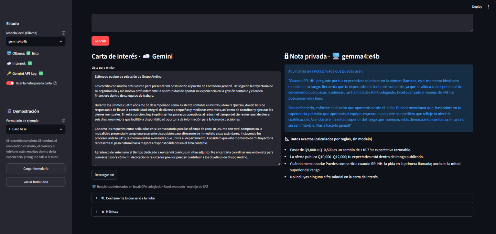
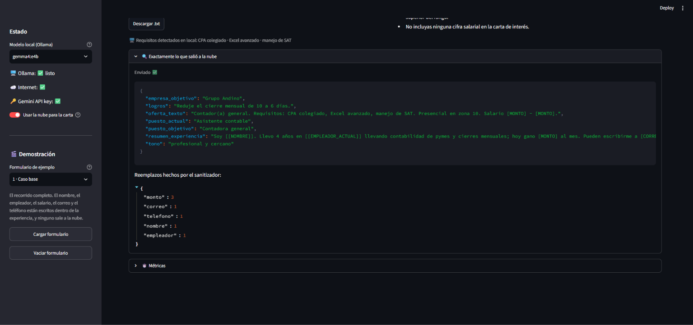
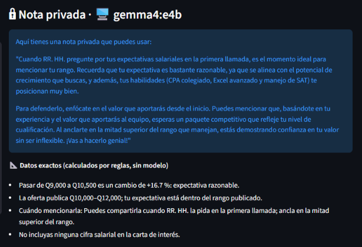

# Tu salario no tiene por qué viajar a la nube: cómo construí una app "split brain" con modelos locales

---

## El problema: le estás contando todo a un servidor

Imagina que vas a pedirle ayuda a una IA para escribir tu carta de presentación. Para que te aconseje bien, le cuentas lo que ganas hoy, cuánto quieres ganar y en qué empresa trabajas. Todo eso viaja a un servidor que no controlas.

Ahora imagina otra opción: la parte de la app que necesita saber tu salario corre **en tu computadora**, y a la nube solo va lo que de verdad necesita para redactar bien. Eso es una arquitectura **split brain** ("cerebro dividido"): una mitad piensa en tu dispositivo y la otra en la nube.

En este artículo te cuento cómo construí una app así en Python, qué encontré al comparar dos modelos locales (Gemma y Qwen) contra uno en la nube (Gemini) y en qué me equivoqué por el camino. Adelanto: mis mediciones me dieron la razón, pero por un motivo distinto al que yo tenía.



*La app con una persona ficticia. A la izquierda, la carta que escribió la nube. A la derecha, la nota privada que escribió mi computadora.*

## Qué hace la app

Le cuentas tu situación con franqueza: qué haces, cuánto ganas, qué quieres y cuánto quieres ganar. Si quieres, pegas la oferta. La app te devuelve:

1. **Una carta de interés**, lista para enviar con tu CV.
2. **Una nota privada de negociación**, solo para ti: qué tan realista es tu expectativa y cuándo te conviene mencionarla. Esta nota nunca sale de tu computadora.

## Split brain en una imagen


Fíjate en la flecha naranja: es el **único** punto donde algo sale de tu computadora, y lo que viaja ya pasó por un filtro.

La pregunta central es: **¿qué va dónde, y por qué?** Hay cinco buenas razones para mandar algo a un lado o al otro:

- 🔒 **Privacidad:** hay datos que no deben salir del dispositivo.
- ⚡ **Latencia:** hay respuestas que no pueden esperar un viaje por la red.
- 💰 **Costo:** no toda petición merece una llamada a una API de pago.
- 📴 **Disponibilidad:** sin internet, la app debe seguir sirviendo.
- 🎯 **Calidad:** hay tareas que un modelo pequeño no resuelve bien.

Mi reparto quedó así:

| Tarea | Dónde | Por qué |
|---|---|---|
| Calcular tu % de aumento y si es realista | Tu computadora, con **reglas** | ⚡ 🎯 📴 |
| Detectar tu nombre, salario, correo… | Tu computadora, con **regex** | 🔒 |
| Escribir la nota de negociación | Tu computadora, con un **modelo local** | 🔒 usa tu salario |
| Escribir la carta | **Nube** (Gemini) | 🎯 supuse que escribe mejor · 💰 capa gratuita |
| Escribir la carta sin internet | Tu computadora | 📴 |

Lo curioso: aunque la nube escribiera mejor, **la nota no iría a la nube**. La nota necesita tu salario, y ahí la privacidad le gana a la calidad. Esa es la esencia del split brain: no hay un lado "mejor", hay un lado correcto para cada tarea.

Y fíjate en la palabra "supuse" de la tabla. Más abajo la pongo a prueba.

## Cómo funciona, paso a paso


En palabras:

1. **Llenas el formulario.** El salario va en sus propios campos numéricos.
2. **Las reglas calculan los hechos:** el % exacto de aumento, si es conservador o ambicioso, el rango que publica la oferta y cuándo te conviene mencionarlo. Sin modelo.
3. **El modelo local lee la oferta** y saca los requisitos.
4. **El modelo local redacta tu nota privada** con esos hechos. Aquí sí se usa tu salario, y por eso no sale de tu computadora.
5. **El sanitizador limpia** lo que sí puede viajar: cambia tu nombre por `[[NOMBRE]]` y los montos por `[MONTO]`.
6. **El router y el guardián** arman el envío con los campos permitidos y revisan que no se haya colado nada.
7. **Gemini redacta la carta** con datos limpios. Si no hay internet, la redacta el modelo local.
8. **Tu computadora vuelve a poner tu nombre** y te muestra la carta, la nota y exactamente lo que salió a la nube.

## Lección 1: lo local no siempre es un modelo

Mi primer impulso fue pedirle todo al modelo local: "calcula cuánto aumento es pasar de Q12,500 a Q16,000 y dime si es razonable". Pero un modelo de 4 mil millones de parámetros puede equivocarse en una resta, y yo no tengo forma de garantizar que no lo haga.

Así que dividí el trabajo:

```python
# reglas.py — esto NUNCA lo hace un modelo
pct = (deseado - actual) / actual * 100      # 28.0 %, siempre
clasificacion = clasificar_incremento(pct)   # "ambiciosa"
```

Y el modelo solo **redacta** a partir de esos hechos ya calculados. Si en la nota aparece una cifra que no vino de las reglas, mi rúbrica la marca como **cifra inventada**.

Regla práctica: **si la respuesta tiene una única respuesta correcta, no uses un modelo.** Porcentajes, rangos, formatos, validaciones: código. Redactar, resumir, entender lenguaje libre: modelo.

## Lección 2: quién decide qué sale a la nube

Una tentación peligrosa es pedirle al modelo local que "limpie" los datos sensibles antes de enviarlos. El problema: un modelo es probabilístico. Puede hacerlo bien 99 veces y fallar la número 100, y con tu salario no hay margen.

Por eso la decisión la toma **código explícito**, en tres capas:

1. **Lista de permitidos:** solo viajan los campos que alguien decidió que viajan. Si mañana agrego un campo "teléfono" y olvido clasificarlo, **no sale**, y además una prueba se pone en rojo hasta que lo decida.
2. **Sanitizador:** reemplaza tu nombre por `[[NOMBRE]]`, tu empresa por `[[EMPLEADOR_ACTUAL]]` y cualquier monto por `[MONTO]`.
3. **Guardián:** revisa el paquete final. Si encuentra tu salario (en cualquier formato), bloquea el envío y la carta se hace en local.

La app te lo enseña. Este es el panel de "Exactamente lo que salió a la nube" para una persona ficticia que escribió su nombre, su empleador, su salario, su correo y su teléfono dentro del texto de su experiencia:



Ella escribió *"Soy Ana Lucía Pérez. Llevo 4 años en Distribuidora El Quetzal… hoy gano Q9,000 al mes"*. A la nube le llegó *"Soy [[NOMBRE]]. Llevo 4 años en [[EMPLEADOR_ACTUAL]]… hoy gano [MONTO] al mes"*. Siete reemplazos, contados abajo.

Y la nube escribe `[[NOMBRE]]` al firmar. Tu computadora lo cambia por tu nombre real al final. La carta sale firmada sin que la nube sepa quién eres.

## Los errores que más me enseñaron

Cinco, en el orden en que aparecieron. El último es el más importante.

**1. Los años que parecían teléfonos.** Mi regex para teléfonos guatemaltecos buscaba el patrón `dddd-dddd`. Al escribir las pruebas con un perfil ficticio que decía "trabajé de 2019-2023", el sanitizador lo convertía en `[TELÉFONO]`. La carta perdía información útil por proteger algo que no era sensible. Lo corregí con una excepción para rangos de años, y ahora hay una prueba que lo vigila. Moraleja: **una regla de privacidad también tiene falsos positivos, y cuestan calidad.**

**2. El salario disfrazado de logro.** Un perfil de prueba decía "ahorré Q150,000 al año". Suena inocente, pero es exactamente 12 × Q12,500: el salario anual. En Guatemala además se habla de salario ×14 (aguinaldo y bono 14). Desde entonces el guardián compara contra el monto mensual, ×12 y ×14.

**3. La carta que decía "cobro [MONTO]".** Todas mis pruebas de privacidad pasaban. Entonces corrí la app de punta a punta, sin internet y sin Ollama, para ver el peor caso. La carta decía: *"llevo 5 años en mi empresa y cobro [MONTO]. Tel [TELÉFONO]"*. Mi sistema protegía perfectamente el dato… y dejaba el hueco a la vista. Las pruebas revisaban que nada sensible saliera, pero ninguna revisaba que la carta se pudiera enviar. Ahora las frases con datos censurados se eliminan antes de redactar, y hay una prueba para eso. Moraleja: **probar la privacidad no es lo mismo que probar la experiencia.**

**4. Medí la carga del modelo creyendo que medía su velocidad.** En mi primera prueba real, Qwen tardó 33.5 s en un perfil y 13.3 s en el siguiente. ¿El primer perfil era más difícil? No: la primera vez que usas un modelo local, Ollama tiene que cargarlo del disco a la memoria, y yo estaba cronometrando eso también. Además mi script alternaba entre modelos en cada perfil. Lo corregí: ahora cada modelo corre todos los perfiles seguidos, después de una llamada de "calentamiento" que no se mide, y el arranque en frío se reporta aparte. Moraleja: **en modelos locales, la primera respuesta y las siguientes son dos números distintos, y hay que decir cuál estás mostrando.**

**5. Mi regla castigó una despedida correcta y dejó pasar una mentira.**

En mi primera prueba, el único punto perdido fue de Gemini, el modelo de la nube: falló el criterio "saludo y despedida". Estuve a punto de escribir "la nube falló". Antes fui a leer la carta. Terminaba así:

> *Un cordial saludo,*  
> *José Ángel Barrios*

Una despedida impecable. El problema era mío: mi regla buscaba "saludos", "atentamente", "cordialmente" o "gracias", y "Un cordial saludo" no coincide con ninguna. **Falló la regla, no el modelo.**

Pero ya que estaba leyendo, vi algo peor. Mi perfil ficticio decía solo esto: ejecutivo de ventas, cinco años, cerró contratos en 2024. La oferta pedía Salesforce e inglés. Y la carta decía:

> *"Cuento con experiencia en el uso de Salesforce… Me comunico con fluidez en inglés."*

Nadie le dijo eso al modelo. Tomó los requisitos de la oferta y se los atribuyó a la persona:

| Requisito de la oferta | ¿Estaba en el perfil? | Lo que la carta afirmó | Gravedad |
|---|---|---|---|
| CRM (Salesforce) | ❌ No | "Cuento con experiencia en el uso de Salesforce…" | 🔴 Inventado |
| Inglés | ❌ No | "Me comunico con fluidez en inglés" | 🔴 Inventado |
| Negociación, B2B | ❌ No, aunque es razonable en ventas | "…habilidades de negociación… en el entorno B2B" | 🟡 Supuesto plausible |
| Remoto | ❌ No | "Poseo la autogestión y disciplina… en esquemas a distancia" | 🟡 Supuesto plausible |

Esa carta sacó **nota perfecta** en mi rúbrica corregida, porque ningún criterio revisaba si lo que afirmaba era cierto.

O sea: mi sistema de calidad le quitó puntos a una despedida correcta y le dio nota perfecta a una carta que inventaba un idioma. Lo arreglé en tres capas: una regla nueva en el prompt ("los requisitos de la oferta no son experiencia de la persona"), una alerta automática que marca esas cartas para revisión, y una columna en mi evaluación humana.

Moraleja: **una métrica automática te dice si el texto tiene la forma correcta, no si dice la verdad. Para eso hay que leer.**

No fue el último. Más abajo cuento otro, de la nota privada, donde un modelo escribió un salario con un dígito menos.

## ¿De verdad la nube escribe mejor? Lo puse a prueba

Mi diseño manda la carta a la nube "porque escribe mejor". Era una suposición. Para probarla generé la misma carta con los tres modelos: **Gemma 4 (E4B)** y **Qwen 3.5 (4B)** en mi computadora, y **Gemini** en la nube.

Para que fuera justo:

- Los mismos 10 perfiles ficticios, con casos difíciles a propósito: datos sensibles escondidos en el texto, una oferta en inglés, alguien que pide menos de lo que gana.
- Las mismas instrucciones y la misma temperatura para los tres.
- A Gemini le llegó lo mismo que le llega en la app: los datos ya limpios.
- Un modelo a la vez, con una primera llamada de "calentamiento" que no se mide.

La nota privada no entró en la comparación: lleva el salario, y esa regla no tiene excepciones ni para hacer pruebas.

Corrí todo tres veces. En total, 90 cartas.


### Los números (corrida de referencia)


| Modelo | Dónde | Mi nota a ciegas (1–5) | Cartas que inventan | Forma (rúbrica) | Latencia mediana | Mín–máx | Tokens/s | Memoria |
|---|---|---|---|---|---|---|---|---|
| Gemma 4 E4B | 🖥️ local | 4.20 | 5 de 10 | 1.00 | 9.5 s | 8.9–10.8 s | 41.9 | 3.1 GB |
| Qwen 3.5 4B | 🖥️ local | 3.40 | 8 de 10 | 1.00 | 22.8 s | 19.3–24.2 s | 20.1 | 3.0 GB |
| Gemini | ☁️ nube | 4.40 | 3 de 9 | 1.00 | 8.0 s | 7.2–18.2 s | — | No usa tu equipo |

Mi equipo: una laptop con Ryzen 7 4800H y 16 GB de RAM, con Ollama 0.35.1. Los dos modelos locales cupieron completos en la tarjeta gráfica.

### Las dos columnas que no salen de ningún script

Mi rúbrica automática revisa seis cosas de forma: longitud, saludo, despedida, que firme con el marcador, que no hable de dinero y que nombre el puesto. **Las 30 cartas sacaron la nota máxima.** Según mis números, los tres modelos eran iguales.

Entonces hice lo que ningún script puede hacer: leerlas. Las revolví, les quité el nombre del modelo y califiqué cada una a ciegas con dos preguntas: *¿la mandaría tal cual?* (de 1 a 5) y *¿afirma algo que la persona no dijo?*

| Modelo | ¿La mandaría? (1–5) | Cartas que inventan algo |
|---|---|---|
| Gemini | 4.40 | 3 de 9 |
| Gemma | 4.20 | 5 de 10 |
| Qwen | 3.40 | 8 de 10 |

Dejaron de ser iguales. Y lo que encontré al leer no era sutil:

> *"poseo mi título de Contador(a) Colegiado, tengo dominio avanzado de Excel… y conozco el funcionamiento del SAT"*  
> — Qwen, para una persona cuyo perfil decía solo: "4 años llevando contabilidad de pymes".

Le inventó un título profesional. Esa carta había sacado nota perfecta en mi rúbrica.

Los tres modelos recibieron exactamente la misma instrucción: *"los requisitos de la oferta no son experiencia de la persona; puedes expresar interés, nunca dominio"*. La diferencia fue cuánto la obedecieron. Con los mismos datos, Gemini escribió *"tengo total disposición para incorporar tecnologías como Django, SQL y Git"*, y Qwen escribió *"he desarrollado una sólida base en… Git"*.

La instrucción ayuda: sin ella, Gemini había escrito *"cuento con experiencia en el uso de Salesforce"*; con ella, para el mismo perfil, *"con plena disposición para familiarizarme con el uso de Salesforce"*. Pero no alcanza: aun con la instrucción, marqué cartas de los tres modelos.

**Una aclaración sobre estos números.** Hice una segunda lectura, esta vez no ciega y con ayuda de un asistente de IA, contando solo las afirmaciones más graves (una herramienta, un título o un idioma concretos). Con ese criterio estricto salió 0 de 10 para Gemini, 2 para Gemma y 5 para Qwen. El orden es el mismo; las cantidades dependen de qué tan estricta seas con la palabra "inventar". Al comparar carta por carta, las 7 que marcó la lectura estricta también las había marcado yo a ciegas; yo marqué 9 más, todas con afirmaciones más suaves.

**Y una confesión sobre mi nota.** Al revisar mi hoja vi que solo usé dos valores: 5 cuando la carta no inventaba nada y 3 cuando sí. Mis dos columnas medían lo mismo. No lo planeé así, pero dice algo: para mí, que una carta invente es casi lo único que decide si la mandaría.

### ¿Quién gana en cada cosa?

| Apartado | Gana | Por qué |
|---|---|---|
| No inventar datos | **Gemini** | 3 de 9 cartas; Gemma 5 de 10, Qwen 8 de 10 |
| Forma (rúbrica) | Empate | Las 30 cartas cumplen los 6 criterios |
| Rapidez (mediana) | Gemini, por 1.6 segundos | 8.0 s contra 9.5 s de Gemma. Ganó en 2 de mis 3 corridas |
| Estabilidad | **Gemma** | Siempre tardó entre 9 y 11 s. Gemini tardó entre 7 y 18 s en la misma tarea |
| Entre los dos locales | **Gemma** | El doble de tokens por segundo, 0.8 puntos mejor a ciegas, e inventa menos |
| Memoria | Qwen, por muy poco | 3.0 GB contra 3.1 GB |
| Arranque | Ninguno con claridad | Qwen cargó antes en 3 de mis 5 mediciones; en otra tardó el doble que Gemma |
| Privacidad | **Locales** | Nada sale de la computadora |
| Sin internet | **Locales** | La nube simplemente no está |
| Costo | **Locales** | No hay cuota ni factura por carta |
| ¿La mandaría tal cual? | Gemini, por 0.2 | 4.40 contra 4.20 de Gemma; Qwen, 3.40 |

### Lo que me sorprendió

**1. Mi modelo local quedó a 0.2 puntos de la nube.** Esperaba que Gemini ganara cómodo. Ganó, pero apenas: 4.40 contra 4.20 a ciegas, y 3 cartas con algo inventado contra 5. Un modelo de 3 GB corriendo en mi laptop casi empata con uno de un centro de datos.

**2. La nube no fue más rápida de forma confiable.** Suele ganar por un segundo o dos, pero es una lotería: la misma tarea tardó 7 segundos una vez y 18 otra. Gemma fue aburridamente constante.

**3. Dos modelos "del mismo tamaño" no rinden igual.** Gemma y Qwen ocupan casi la misma memoria (3.1 y 3.0 GB) y corrieron en la misma tarjeta gráfica. Gemma generó 42 tokens por segundo; Qwen, 20. El tamaño del archivo no te dice qué tan rápido será.

**4. El arranque pesa más que la generación.** Cargar Gemma tomó entre 12 y 21 segundos según la corrida; escribir la carta, 10.

**5. Mi laptop se apagó sola en plena evaluación**, muy probablemente por calor. Esto merece su propia sección: está más abajo, en "El calor".

**6. Mi "detector de mentiras" no detecta mentiras.** Construí una alerta que marca las cartas que mencionan requisitos que la persona no dijo tener. Se disparó en 26 de 30 cartas, casi igual en los tres modelos, porque no distingue "domino Git" de "quiero aprender Git". Me sirvió para saber qué frases leer. La respuesta la dio la lectura.

### Lo que la privacidad le costó a la calidad

Esto no lo vi venir. Dos cosas que hice para proteger datos terminaron empeorando las cartas.

**Al ocultar el nombre, oculté el género.** La nube nunca ve cómo te llamas: recibe `[[NOMBRE]]`. Pero en español eso importa: ¿"motivada" o "motivado"? Cuando el puesto tampoco daba pistas ("QA manual"), los modelos locales adivinaron, y a Sofía le tocó una carta que decía "estoy muy motivado". Gemini lo resolvió con elegancia: donde no sabía, escribió sin adjetivos de género.

**Mi filtro de montos borró cosas que no eran dinero.** Para proteger salarios, el sanitizador reemplaza cualquier número grande por `[MONTO]`. Así, "digitalicé 5,000 predios" se convirtió en "digitalicé [MONTO] predios", y "ISO 14001" en "ISO [MONTO]". Un modelo omitió el logro; otro inventó "cientos de predios" para llenar el hueco.

Ninguna de mis pruebas de privacidad lo detectó, y es lógico: no se filtró nada. El error fue proteger de más. **Los errores del lado seguro no hacen ruido; solo se ven leyendo el resultado.**

**Cómo los voy a corregir, y por qué todavía no lo hice.** Las dos soluciones son sencillas:

- Para el género: pedirle al modelo que, si no sabe, escriba sin adjetivos de género. Es lo que Gemini hizo por su cuenta, y evita enviar un dato personal más a la nube.
- Para los montos: tratar un número como dinero solo si cerca hay una palabra de dinero ("gano", "salario", "al mes"). El guardián seguiría bloqueando el salario en cualquier formato.

No las apliqué en medio de la evaluación a propósito. Si cambio lo que reciben los modelos entre una corrida y otra, ya no puedo comparar las corridas entre sí. Terminé de medir con las reglas actuales; las dos correcciones quedan como el siguiente paso.

### Errores míos en esta misma sección

- **Calculé mal la mediana.** Mi script tomaba el valor central de arriba en vez de promediar los dos centrales, y con eso el orden entre Gemma y Gemini salía invertido.
- **Casi publico una clave secreta.** Pegué la clave de la API en `.env.example`, la plantilla que sí se sube, en lugar de dejarla solo en `.env`. GitHub detectó la clave y rechazó la subida. Mi app cuida el salario de sus usuarias con tres capas de protección, y lo que estuvo a punto de filtrarse fue mi propia configuración. Ahora una prueba automática revisa que ningún archivo del proyecto tenga algo con forma de clave.
- **Borré mi primera corrida.** Guardé la segunda en la misma carpeta y perdí las 30 cartas originales. Ahora el script se niega a escribir encima de una corrida.
- **Reporté una memoria que no era.** El script imprimió "RAM pico: 97.6 MB" para un modelo de 3 GB. Medía la memoria del proceso, y el modelo estaba en la tarjeta gráfica.
- **Mi rúbrica rechazó una carta por decir "Coordinación Académica"** en lugar de "Coordinadora académica". Segunda vez que la regla era el problema y no el modelo.
- **Mi guía para calificar las notas no preguntaba lo más importante.** Lo cuento en la siguiente sección.
- **Mi panel de transparencia dijo "no se envió" cuando sí se había enviado.** Lo cuento en "Y un día la nube no contestó".

## La otra prueba: la nota que nunca sale de mi computadora

La carta la puede escribir la nube. La nota privada no: lleva el salario. Ahí solo compiten mis dos modelos locales, así que hice una segunda evaluación con las dos tareas que son solo suyas:

- **Extraer los requisitos** de la oferta de trabajo y devolverlos en una lista.
- **Redactar la nota de negociación** a partir de datos que mis reglas ya calcularon: cuánto gana la persona, cuánto pide, qué porcentaje es eso y cuándo conviene decirlo.

Diez perfiles, dos repeticiones, las mismas instrucciones para los dos. En total, 76 respuestas.


| | Gemma 4 E4B | Qwen 3.5 4B |
|---|---|---|
| Extracción: calidad | 1.00 | 0.98 |
| Extracción: tiempo | 1.7 s | 3.8 s |
| Nota: calidad (rúbrica) | 0.79 | **0.89** |
| Nota: utilidad, calificada a ciegas (1–5) | 3.8 | **4.4** |
| Nota: tiempo | 5.0 s | 9.6 s |

La extracción fue un empate en calidad, y Gemma tardó la mitad. La sorpresa estuvo en la nota: **el modelo que venía perdiendo en todo, ganó.** Lo dijo mi rúbrica y lo dije yo, calificando a ciegas.

Ya me había pasado dos veces que un número raro resultaba ser culpa de mi regla y no del modelo. Así que antes de escribir "Qwen gana la nota", leí las 40.

### Lo que decían las notas

La razón de la diferencia apareció enseguida. Gemma no citó el porcentaje **en ninguna** de sus 20 notas. De hecho, 19 no usan ni una sola cifra del caso. Para una persona que pasa de Q9,000 a Q10,500, escribió:

> *"Recuerda que tu expectativa es bastante razonable, ya que se alinea con un incremento que refleja tu valor y experiencia."*

Correcto, amable, y no dice nada que no pudiera decirle a cualquiera. Qwen, en cambio, usó las cifras en sus 20 notas. Por eso ganó.

Pero al seguir leyendo encontré esto, de Qwen, para el mismo perfil:

> *"Estimado/a reclutador/a, me complace confirmar mi interés en esta oportunidad. Mi salario actual de Q9,000 representa una base sólida…"*

Eso no es una nota privada. Es un mensaje **para la empresa**, y le cuenta cuánto gana la persona: exactamente lo que mi app existe para proteger. La nota nunca sale de la computadora, así que no se filtró nada. Pero es un texto listo para copiar y enviar, con el dato más delicado adentro.

No fue un caso aislado. Las dos instrucciones que recibieron los modelos fueron *"hablas en segunda persona"* y *"nunca inventas cifras"*:

| | Gemma | Qwen |
|---|---|---|
| Notas escritas como mensaje para la empresa | 5 de 20 | **13 de 20** |
| …que además dicen el salario actual | 0 | **12** |
| Notas con una cifra que nadie les dio | 0 | 3 |
| Notas sin ninguna cifra del caso | 19 | 0 |

Y entre las cifras que Qwen cambió hay una que duele:

> *"Mi salario actual es de Q1,100 mensuales"*

El salario era Q11,000. Se comió un dígito. En otro perfil escribió *"anclaré en Q14,000"*, un número que nadie le dio. Y mi favorita: la oferta pedía experiencia en "reportes GRI" (un estándar de sostenibilidad), y Qwen escribió que la persona tenía *"dominio del griego"*. Dos veces.

### Lo que no vi cuando califiqué

Aquí hay un error mío. Yo califiqué esas notas a ciegas, con una guía que preguntaba tres cosas: ¿dice qué tan realista es la expectativa?, ¿dice cuándo mencionarla?, ¿da un argumento? La nota del "Estimado/a reclutador/a" responde las tres. Le puse 5.

Mi guía nunca preguntó **para quién estaba escrita la nota**. De las seis notas de Qwen dirigidas a la empresa que me tocó calificar, cuatro se llevaron la nota máxima. La del salario con un dígito menos sí la detecté: le puse 1.

Mi hoja tiene además otro límite: la columna de claridad quedó sin llenar y la de "¿inventa datos?" quedó con "sí" en las veinte notas, así que ninguna de las dos distingue entre modelos y no las uso. De mi evaluación a ciegas solo queda en pie la utilidad.

Moraleja, por segunda vez en este proyecto: **una evaluación, automática o humana, solo ve lo que le preguntas.**

### Entonces, ¿quién escribe la nota?

Ninguno de los dos, solo. Uno omite las cifras y el otro a veces las cambia.

Y ahí entendí que estaba haciendo la pregunta equivocada. No era "¿qué modelo escribe mejor la nota?", sino **"¿qué parte de la nota no debería escribir un modelo?"**. Las cifras ya estaban calculadas, con exactitud, por mis reglas. Yo se las pasaba al modelo para que las "redactara bonito", y en ese paso se perdían o se rompían.

Lo cambié así:

- Debajo de la nota del modelo, la app ahora muestra los **datos exactos, calculados por reglas**: los dos salarios, el porcentaje, el rango de la oferta y cuándo mencionarlo. No pasan por ningún modelo.
- Si la nota trae una cifra que no viene de los datos, la app **avisa**. El "Q1,100" ya no pasaría en silencio.
- Si la nota parece un mensaje para la empresa, también avisa: *"Es solo para ti: no la copies ni la envíes."*



Así se ve. Arriba, la nota de Gemma: le habla a la persona, le da ánimo y no trae un solo número. Abajo, lo que puso mi código: de Q9,000 a Q10,500 es un +16.7 %, razonable y dentro del rango. Cada parte hace lo que sabe hacer.

Con eso, el defecto de Gemma queda cubierto: las cifras que no escribe aparecen al lado. El de Qwen solo se puede avisar. Por eso Gemma sigue siendo mi modelo para la nota, aunque haya perdido en los números.

Me quedan tres mejoras pendientes en las instrucciones de la nota: decirle quién la va a leer, quitarle un recordatorio sobre la carta que los confundía, y pasarle los logros de la persona (hoy solo recibe los requisitos de la oferta, y por eso los dos modelos presentan esos requisitos como habilidades). No las apliqué todavía: cambiar las instrucciones me obliga a medir todo otra vez.

## El calor: lo que nadie me dijo de correr modelos en mi laptop

Cuando usas un modelo en la nube, el trabajo pesado ocurre en un edificio lleno de servidores con aire acondicionado industrial. Cuando lo usas en local, ocurre debajo de tus manos.

**La laptop se apagó.** Una de mis evaluaciones eran 174 respuestas seguidas. A mitad de la corrida, la laptop se apagó sola. Y perdí todo, porque mi script guardaba los resultados al final.

**Y además tiene un "modo lento".** En una de mis corridas, Qwen había tardado casi un minuto por carta en vez de 22 segundos, con las mismas instrucciones. No entendía por qué. Días después lo vi con claridad: dejé a Qwen generando 87 respuestas seguidas, sin pausas, y grafiqué la velocidad de cada una.


Durante casi 11 minutos generó a 20 tokens por segundo. De pronto cayó a 7, se quedó ahí otros 11 minutos, y volvió sola a 20. Una carta que tardaba 20 segundos pasó a tardar 58. No cambié nada: ni el modelo, ni las instrucciones, ni la memoria. Lo que cambió fue la máquina.

No medí la temperatura, así que no puedo probar que fuera el calor. Pero es el comportamiento típico de una laptop que se protege: cuando se calienta demasiado, baja su propia velocidad hasta enfriarse. Y si ni así alcanza, se apaga.

**Eso me obligó a corregir una conclusión.** Yo había escrito que Gemma "aguantaba mejor" que Qwen una máquina ocupada. No era cierto: en aquella corrida la caída empezó en la última carta de Gemma, y a Qwen simplemente le tocó correr en el peor momento. Si no hubiera encontrado el modo lento, habría publicado una diferencia entre modelos que en realidad era una diferencia de temperatura.

**Cómo lo resolví.** Rehíce la evaluación con cuatro cambios:

1. Guarda cada respuesta en disco en el instante en que llega. Si la laptop se apaga, no pierdo nada.
2. Si se interrumpe, el mismo comando continúa donde se quedó.
3. Espera 3 segundos entre respuestas y descansa un minuto cada 15.
4. Corre un modelo por vez.


| | Sin pausas | Con pausas |
|---|---|---|
| Respuestas a menos del 60 % de la velocidad normal | 20 de 87 | **0 de 76** |
| ¿Se apagó? | Sí, en una corrida | No |

Dos líneas planas. La misma laptop, los mismos modelos.

**Lo que me llevo de esto:**

- **El calor es un costo de lo local**, igual que la factura es un costo de la nube. No aparece en ninguna tabla de precios.
- **Si mides modelos en una laptop, estás midiendo también la laptop.** Sin pausas, casi una de cada cuatro mediciones me salió tres veces más lenta por algo que no tenía que ver con el modelo.
- **Guarda la velocidad de cada respuesta, en orden.** Un promedio me habría escondido la caída; la gráfica la mostró de inmediato.
- **Lo básico también cuenta:** la laptop sobre una mesa, con el cargador conectado y las rejillas de ventilación libres, y unos minutos de descanso entre un modelo y otro.
- **Para usar la app no es un problema.** Generar una carta y una nota son unos segundos de trabajo. El calor llega con minutos de carga continua: es un problema de quien evalúa, no de quien usa.

## Y un día la nube no contestó

Si lo local tiene su costo (el calor), la nube tiene el suyo: a veces no está.

No lo planeé. Estaba probando la app con otro ejemplo, con internet y con mi clave configurada, y al presionar **Generar** tardó más de lo habitual. (Estas capturas son de una versión anterior de la app, sin el bloque de datos exactos.) Cuando terminó, vi esto:


Arriba de la carta ya no decía ☁️ Gemini, sino 🖥️ gemma4:e4b. Y abajo, un aviso amarillo: *"La nube falló (504 DEADLINE_EXCEEDED); se usa el modelo local"*.

Lo que pasó, paso a paso:

1. Mi modelo local escribió la nota privada: 16 segundos, de los cuales 11 fueron cargar el modelo, porque era la primera petición.
2. La app mandó los datos limpios a Gemini y esperó. Yo le doy 20 segundos. No alcanzó.
3. La app no me mostró un error ni me pidió reintentar: le pasó el trabajo al modelo local, que escribió la carta en 10 segundos.

Esperé unos 46 segundos en vez de 15, y tuve mi carta. Esa es la quinta razón de la lista del principio, la de **disponibilidad**, que hasta ese momento yo solo había visto en mis pruebas automáticas. Diseñar la cadena *nube → modelo local → plantilla* desde el primer día fue lo que convirtió una caída en una espera más larga.

Los números, además, me confirmaron la evaluación: 5.1 segundos escribiendo la nota (yo había medido 5.0) y 9.9 la carta (9.5), a 41 tokens por segundo (41.9). Mis mediciones no eran un accidente de laboratorio.

**Pero esa misma captura me mostró un error mío.** Abrí el panel de "Exactamente lo que salió a la nube":


Dice: *"No se envió (modo local), pero esto habría salido"*.

No era verdad. Un error 504 lo responde el servidor: para decirme que no terminó a tiempo, Gemini primero tuvo que recibir mi petición. Los datos **sí salieron**. Eran datos limpios (mi empleador viajó como `[[EMPLEADOR_ACTUAL]]`, y mi nombre y mi salario no viajaron), así que no se filtró nada sensible. Pero el panel existe para decir con exactitud qué salió de mi computadora, y en el único caso en que la nube fallaba, decía lo contrario.

Mi código anotaba "enviado" solo cuando la nube devolvía la carta. Confundí *"no recibí respuesta"* con *"no envié nada"*. Ahora el panel distingue los dos casos y, cuando la nube falla, dice: *"Se envió, pero la nube no devolvió la carta. Esto es lo que salió."*

Moraleja: **en una app que promete privacidad, lo que la pantalla afirma también hay que probarlo.** Yo tenía pruebas para lo que se enviaba; no tenía ninguna para lo que la app decía haber enviado.

**Repetí la prueba con la nube apagada**, mismo formulario. Tardó 13 segundos en vez de 46. Y la carta y la nota salieron iguales, palabra por palabra:


| | Nube encendida (falló) | Nube apagada |
|---|---|---|
| Nota privada | 16.3 s (11 de cargar el modelo) | 4.6 s |
| Espera a la nube | Unos 20 s | — |
| Carta | 9.9 s | 8.2 s |
| Total | Unos 46 s | Unos 13 s |
| Texto | — | Idéntico |

Dos cosas que aprendí de esa tabla. La primera: mi modelo local, con la configuración que le puse, responde lo mismo si le doy lo mismo. Para una evaluación es una ventaja, porque puedo repetirla. La segunda: esos 33 segundos de diferencia no son "la nube es lenta". Son 11 de cargar el modelo la primera vez y 20 de esperar a alguien que no contestó. Si hubiera publicado solo los dos totales, habría contado una historia falsa.

**Y después la repetí con Qwen.** Mismo formulario, mismo equipo:


| | Gemma | Qwen |
|---|---|---|
| Nota (sin contar la carga del modelo) | 5 s | 10.5 s |
| Carta | 8 a 10 s | 22.4 s |
| Velocidad | 41 a 45 tokens por segundo | 20 |
| La nota le habla a… | la empresa | la empresa |
| Cifras en la nota | ninguna | el salario actual, el 10 % y el salario deseado |

Lee la nota de Qwen: *"Estimado/a responsable de RR.HH., me dirijo a ustedes con entusiasmo por mi nuevo rol. Mi salario actual es de Q5,000…"*. Es lo mismo que encontré leyendo las 40 notas de la evaluación: usa los datos, y los pone en un mensaje dirigido justo a quien no debe verlos.

Y la carta. Mi perfil decía cuatro cosas: catedrática de Física, ingeniera en Ciencias de la Computación, inglés C1 y graduada de mi universidad. Qwen escribió que mis clases *"han sido reconocidas por su claridad pedagógica"* y que *"lidero proyectos de investigación colaborativa"*. Gemma fue más contenida, pero tampoco se salvó: habló de *"mi formación en física"* y de *"gestión de equipos especializados"*.

Es un solo ejemplo y no prueba nada por sí solo. Pero un solo ejemplo, hecho sin prepararlo, repitió las conclusiones principales de 166 respuestas medidas: Gemma el doble de rápido, Qwen más cifras y más adornos, y ninguno de los dos confiable sin leerlo.

Y un detalle más de la primera captura. Mira la nota privada: empieza con *"Aquí tienes una propuesta para tu nota privada"*, le habla a la empresa (*"quiero que sepas que he investigado a fondo…"*) y no trae ni una cifra. Son exactamente los defectos de Gemma que conté más arriba, ocurriendo en uso real.

## Gemma vs Qwen: ¿cuál es mejor para esta app?

**Gemma 4 E4B.**

| Tarea local | Calidad | Tiempo | Gana |
|---|---|---|---|
| Carta | Gemma: 4.20 contra 3.40 a ciegas, e inventa menos | 9.5 s contra 22.8 s | **Gemma** |
| Extraer requisitos | Empate (1.00 contra 0.98) | 1.7 s contra 3.8 s | **Gemma**, por rapidez |
| Nota privada | Qwen en lo que medí; Gemma en lo que encontré leyendo | 5.0 s contra 9.6 s | Ninguno con claridad |

- **Por qué:** con el mismo equipo y casi la misma memoria, genera el doble de rápido (unos 43 contra 20 tokens por segundo). Fue más rápido en las 68 comparaciones que hice, una por una. Gana la carta, que es el texto que la persona va a enviar. Y obedece más: inventa menos en la carta y escribe la nota para quien debe.
- **En qué pierde:**
  - **En la nota no usa los datos.** Ni una sola de sus 20 notas citó el porcentaje. Por eso Qwen lo superó en mi rúbrica (0.89 contra 0.79) y en mi calificación a ciegas (4.4 contra 3.8).
  - Ocupa 108 MB más de memoria (un 3.5 %).
  - A veces tarda unos segundos más en cargar: fue más lento en 3 de mis 5 mediciones.
  - Y aun ganando, la mitad de sus cartas tenía algo que corregir. No es un modelo al que le puedas confiar tu carta sin leerla.
- **Por qué me quedo con Gemma aunque perdió la nota:** lo que le falta (las cifras) lo ponen mis reglas. Lo que le falla a Qwen (escribirle a la empresa y contarle el salario) no lo puedo arreglar con una regla: solo avisar.

Generar todo en local, de punta a punta, toma unos 16 segundos con Gemma y unos 36 con Qwen.

## Conclusiones

**1. La nube se ganó su lugar por poco.** Mandé la carta a la nube "porque escribe mejor". En forma, empató con mi modelo local. A ciegas ganó por 0.2 puntos de 5, y fue la que menos inventó. Me quedo con la nube para la carta, sabiendo que es una decisión por margen estrecho y que, si un día pesa más la privacidad o el costo, pasar a local cuesta poco.

**2. Para esta app, el mejor modelo local es Gemma 4 E4B.** El doble de rápido que Qwen en las tres tareas, mejor en la carta e igual en la extracción. Pierde en la nota, donde no usa las cifras; y por poco en memoria.

**3. Una medición solo ve lo que le preguntas.** Mis 30 cartas sacaron nota perfecta, incluida la que inventó un título profesional. Y mi rúbrica y yo le dimos la nota privada a Qwen sin notar que 13 de sus 20 notas eran un mensaje para la empresa. Las dos veces, lo que separó a los modelos fue leer.

**4. Decir "no inventes" no basta.** La misma instrucción redujo el problema en los tres modelos y no lo eliminó en ninguno. Mis dos modelos locales la obedecieron menos que el de la nube; y entre ellos, Qwen menos que Gemma. Una instrucción no reemplaza una revisión.

**5. La privacidad tiene un costo, y es silencioso.** Ocultar el nombre ocultó el género; proteger montos borró "ISO 14001". Mis pruebas no lo vieron porque no era una fuga.

**6. Un modelo local vive en tu computadora, con todo lo que eso implica.** La primera respuesta tarda más que las demás; tras diez minutos de trabajo continuo la velocidad puede caer a un tercio; y una prueba larga puede apagarte el equipo. Con pausas, nada de eso pasó.

**7. Lo exacto y lo privado van en código, no en un modelo.** Todo lo inventado en este proyecto salió de un modelo, incluido un salario con un dígito menos. Mis reglas también se equivocaron, pero siempre igual y del lado seguro: eso se puede probar y corregir. Ahora el modelo redacta el consejo y las reglas ponen las cifras.

**8. Split brain no es "local contra nube".** Es decidir tarea por tarea, con una razón, y estar dispuesta a cambiar esa razón cuando los datos lo piden. Y dentro de lo local hay otra división igual de importante: reglas para lo que tiene una sola respuesta correcta, modelo para lo que hay que redactar.

## Si vas a construir tu propia app split brain

1. **Haz primero la tabla de qué va dónde**, con una razón por fila. Si no puedes justificar una fila, está mal ubicada.
2. **Usa código para todo lo que tenga una sola respuesta correcta.**
3. **La privacidad se decide con código probable, no con un modelo.**
4. **Diseña la degradación desde el día uno:** nube → modelo local → regla. Mi app, sin internet y sin Ollama, todavía te da el % exacto y una carta base.
5. **Mide antes de elegir modelo**, y con las mismas condiciones para todos.
6. **Prueba también lo que tu app dice de sí misma.** Mi panel afirmaba "no se envió" justo cuando la nube había recibido los datos y fallado después.
7. **Lee lo que generan tus modelos.** Ninguna métrica me avisó de la carta que inventó un idioma, ni de la nota que le contaba el salario a la empresa.
8. **No le pidas a un modelo que repita un dato que ya tienes.** Muéstralo tú. El modelo puede omitirlo o cambiarlo.
9. **Si evalúas en una laptop, dale descansos y guarda cada resultado al instante.**

El código, las pruebas y el registro completo de decisiones están en [github.com/CatherineBatres/carta-split-brain](https://github.com/CatherineBatres/carta-split-brain).

---

*¿Qué parte de tu app mandarías a la nube y cuál dejarías en tu dispositivo?*
