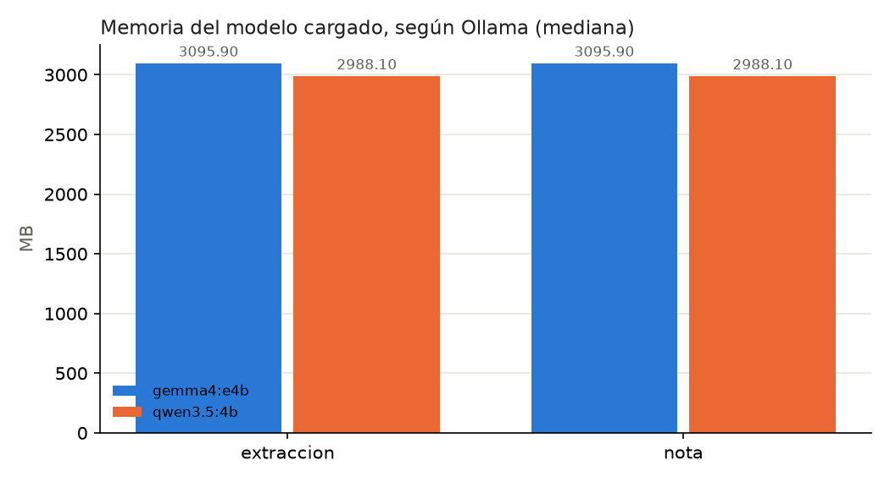

# Resultados del benchmark

## Resumen por tarea y modelo

|                              |   calidad |   latencia_total_s |   tokens_por_s |   ps_size_mb |   ps_vram_mb |   latencia_max_s |   primer_token_s |
|:-----------------------------|----------:|-------------------:|---------------:|-------------:|-------------:|-----------------:|-----------------:|
| ('extraccion', 'gemma4:e4b') |     1     |              1.695 |          44.55 |       3095.9 |       3095.9 |            2.835 |            0.783 |
| ('extraccion', 'qwen3.5:4b') |     0.978 |              3.796 |          20.8  |       2988.1 |       2988.1 |            4.438 |            1.181 |
| ('nota', 'gemma4:e4b')       |     0.79  |              5.01  |          43.7  |       3095.9 |       3095.9 |            6.076 |            0.958 |
| ('nota', 'qwen3.5:4b')       |     0.89  |              9.595 |          20.4  |       2988.1 |       2988.1 |           13.204 |            2.12  |

## Criterios de la rúbrica (proporción que cumple)

|                              |   longitud_ok |   cita_porcentaje |   sin_cifras_inventadas |   dice_cuando |   en_espanol |   json_valido |   recall_requisitos |   modalidad_ok |
|:-----------------------------|--------------:|------------------:|------------------------:|--------------:|-------------:|--------------:|--------------------:|---------------:|
| ('extraccion', 'gemma4:e4b') |           nan |             nan   |                  nan    |        nan    |          nan |             1 |                1    |              1 |
| ('extraccion', 'qwen3.5:4b') |           nan |             nan   |                  nan    |        nan    |          nan |             1 |                0.94 |              1 |
| ('nota', 'gemma4:e4b')       |             1 |               0   |                    1    |          0.95 |            1 |           nan |              nan    |            nan |
| ('nota', 'qwen3.5:4b')       |             1 |               0.7 |                    0.85 |          0.9  |            1 |           nan |              nan    |            nan |

## Ritmo: ¿bajó la velocidad durante la corrida?

| modelo     |   respuestas |   a_ritmo_lento |   tokens_s_normal |   tokens_s_lento |
|:-----------|-------------:|----------------:|------------------:|-----------------:|
| gemma4:e4b |           38 |               0 |              43.9 |              nan |
| qwen3.5:4b |           38 |               0 |              20.5 |              nan |

*A ritmo lento*: respuestas generadas a menos del 60 % de la velocidad normal del modelo (señal de que el equipo se calentó o estaba ocupado).

## Arranque en frío

```json
{
  "gemma4:e4b": {
    "carga_modelo_s": 11.622,
    "latencia_total_s": 12.134,
    "ps_size_mb": 3095.9,
    "ps_vram_mb": 3095.9
  },
  "qwen3.5:4b": {
    "carga_modelo_s": 9.026,
    "latencia_total_s": 10.014,
    "ps_size_mb": 2988.1,
    "ps_vram_mb": 2988.1
  }
}
```

## Evaluación humana ciega de las notas (1–5)

| modelo     |   n | claridad_1a5   |   utilidad_1a5 |   inventa_n |   inventa_de |
|:-----------|----:|:---------------|---------------:|------------:|-------------:|
| qwen3.5:4b |  10 |                |            4.4 |          10 |           10 |
| gemma4:e4b |  10 |                |            3.8 |          10 |           10 |

## Gráficas



