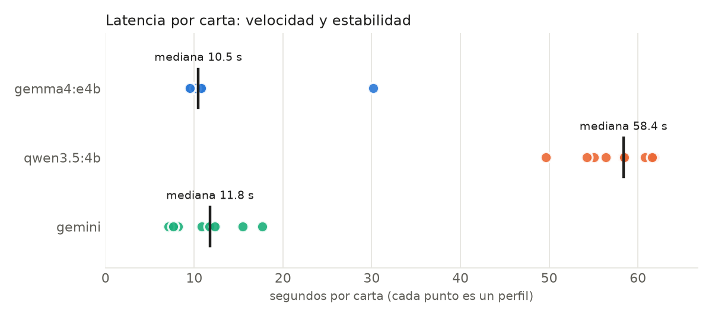

# Resumen: carta en Gemma, Qwen y Gemini

| Modelo | Dónde | Calidad (rúbrica) | Cartas 6/6 | Con alerta | Latencia mediana | Mín–máx | Desv. | Arranque | Tokens/s | RAM pico |
|---|---|---|---|---|---|---|---|---|---|---|
| gemma4:e4b | 🖥️ local | 0.98 | 9/10 | 8/10 | 10.46 s | 9.42–30.16 s | 6.33 s | — | — | — |
| qwen3.5:4b | 🖥️ local | 0.98 | 9/10 | 9/10 | 58.37 s | 49.6–61.8 s | 3.79 s | — | — | — |
| gemini | ☁️ nube | 1.00 | 10/10 | 9/10 | 11.78 s | 7.09–17.63 s | 3.34 s | — | — | — |

- *Con alerta*: cartas que mencionan requisitos de la oferta que la persona no dijo tener (revisar a mano).
- *Arranque*: carga del modelo + primera respuesta; no entra en la latencia.

