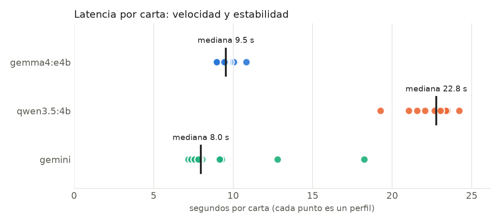

# Resumen: carta en Gemma, Qwen y Gemini

| Modelo | Dónde | Calidad (rúbrica) | Cartas 6/6 | Con alerta | Latencia mediana | Mín–máx | Desv. | Arranque | Tokens/s | Modelo en memoria | De eso, en GPU | RAM del proceso |
|---|---|---|---|---|---|---|---|---|---|---|---|---|
| gemma4:e4b | 🖥️ local | 0.98 | 9/10 | 8/10 | 9.54 s | 8.91–10.82 s | 0.58 s | 20.9 s | 41.85 | 3095.9 MB | 3095.9 MB | 97.6 MB |
| qwen3.5:4b | 🖥️ local | 0.98 | 9/10 | 9/10 | 22.77 s | 19.26–24.21 s | 1.44 s | 13.1 s | 20.1 | 2988.1 MB | 2988.1 MB | 98.3 MB |
| gemini | ☁️ nube | 1.00 | 10/10 | 9/10 | 7.97 s | 7.18–18.25 s | 3.48 s | 9.4 s | — | — | — | — |

- *Con alerta*: cartas que mencionan requisitos de la oferta que la persona no dijo tener (revisar a mano; NO es un puntaje).
- *Arranque*: carga del modelo desde cero + primera respuesta; no entra en la latencia.
- *Modelo en memoria*: lo que reporta Ollama (`/api/ps`); es el dato de memoria que vale. *RAM del proceso* es solo la memoria principal del proceso de Ollama: si el modelo corre en la tarjeta gráfica, casi todo está en la GPU y este número sale muy bajo.

